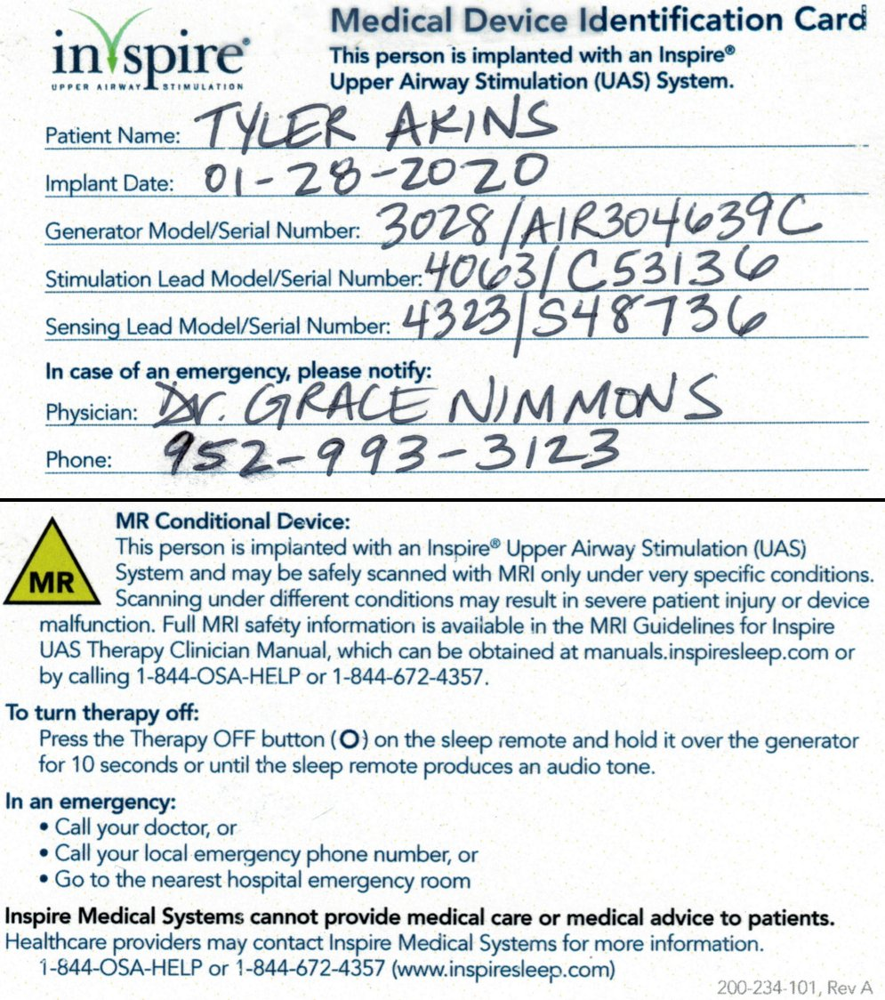

Medical Summary
---------------

* NO MRI for torso area - implanted device to prevent sleep apnea (Inspire&reg; sleep system, hypoglossal nerve stimulator)
* Diabetes, Type 2 (controlled with diet + medications listed below)
* High blood pressure
* High cholesterol
* Allergies: metal taste with influenza virus vaccines
* Blood type: A+
* Macular edema (controlled with eye injections)

Medications
-----------

* Aspirin, 81 mg daily AM
* Atorvastatin, 40 mg daily PM (high cholesterol)
* Avastin (Bevacizumab), 25mg as needed (macular edema)
* Cetirizine HCl, 10 mg daily AM (generic allergy pill)
* Hydrochlorothiazide, 25 mg daily AM (kidney functions, control potassium) **currently not taking, expect to get back on this**
* Lisinopril, 20mg daily AM (high blood pressure)
* Metformin HCl, 1000 mg twice daily AM+PM (Diabetes)

Last checked: 2022-05-23

Contact Information
-------------------

    Tyler Akins
    12650 130th Ave N.
    Dayton, MN 55327
    612-387-8102

In case of emergency, contact:

* Sarah Akins (Wife) <a href="tel:6123966261">612-396-6261</a>
* Bruce / Dori Akins (Parents) <a href="tel:9529551133">952-955-1133</a>

Physician Information
---------------------

Current physician retired. Contact Park Nicollet clinic. <a href="tel:9529934900">952-993-4900</a>

    Park Nicollet Clinic - Brookdale
    6000 Earle Brown Drive
    Brooklyn Center, MN 55430

Retina specialist: Dr. Shawn M. Ronin, MD <a href="9529933150">952-993-3150</a>

    Park Nicollet Clinic - St. Louis Park
    3900 Park Nicollet Blvd.
    Suite 290
    St. Louis Park, MN 55416

Other Notes
-----------

Registered organ donor. Contact 1-888-5-DONATE or <a href="mailto:info@life-source.org">info@life-source.org</a> with donor registration questions. If anyone can benefit from my body (including students), I'd prefer to help humanity after I'm gone.

Strong desire to have a relatively good "quality of life." Please do not keep me alive if I won't be able to function.
