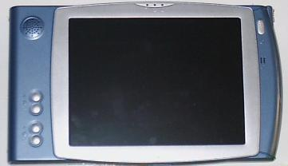
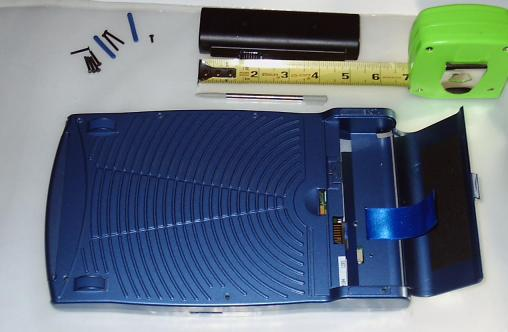
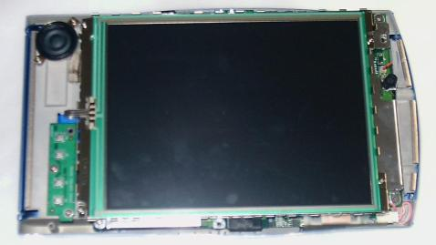
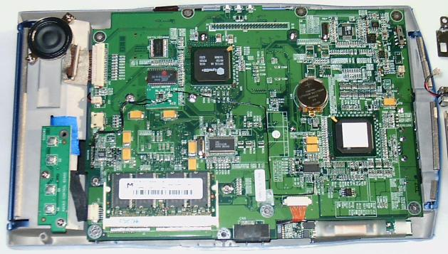
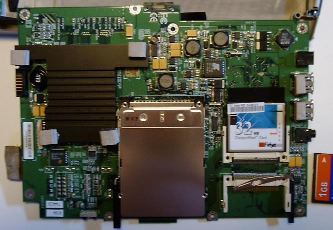

The AquaPad is a light web tablet that can run Windows CE, 2000, ME, and Midori Linux.  I'm not really one for words, so here's some stats.

    Processor:  Transmeta Crusoe 5400 at 500 Mhz
	Display:    8.4" TFT 800x600, touchscreen.  PenMount DMC9000.
	Memory:     128 Mb.  Some have 64 and Windows 2000 ones say 256.
	            SO-DIMM SDRAM, Non-ECC, PC133, 256 Mb max (*)
	Storage:    32 Mb CompactFlash, Type II
	            Windows variants get a 1 Gb MicroDrive instead
	Video:      Silicon Motion Lynx EM+ SM712, 2 Mb integrated frame buffer
	Audio:      Crystal CS4297A
	Wireless:   802.11b only with optional PCmCIA card
	            IRDA, Fast Infrared (FIR) at 4 Mbps
	OS:         Midori Linux or Windows 2000
	Power:      4-cell Lithium-ion, 3200 mA, about 2-3 hour battery life
	            ACPI compliant, support suspend/sleep modes
				Power jack (12V 3A) and cradle port
	BIOS:       AMI
	I/O:        PCMCIA PC-Card Type II w/ 32-bit CardBus support
	            Type II Compact Flash slot (external)
				Bluetooth provision (unsure what that meant)
				2 USB 1.1 ports
				Internal microphone and speaker, headphone jack
	Dimensions: 10.6" x 6.3"
	Weight:     1.5 Lb
	Other:      Digital contrast and volume (no on-screen indicators for Midori)
	            Optional cradle to power device and a second battery

(*) See Upgrades section for more information

Midori Linux shipped with a Todo application, notepad, web browser and *very* basic stuff.  There was a half-screen pop-up keyboard and some really bad handwriting recognition.

The CompactFlash slots accept type I and type II cards.  The only snag is that the opening in the case to access the CF slot is too thin to allow CompactFlash type II cards, like a microdrive.  Either you need to mount your microdrive inside the tablet, or you are going to get creative with a Dremel tool.
	
As far as wireless networking goes, Midori on the AquaPad only comes with drivers for a limited number of PCMCIA cards.  Make sure you get a Cisco 350 series, Cisco 340 series, Lucent Agere, or Orinoco Silver.

Locally Hosted Files
====================

* [Audio Drivers](drivers_audio.zip) - Windows audio drivers.

* [VGA Drivers](drivers_vga.zip) - Windows VGA drivers.

* [Touch Screen Drivers](drivers_touch-screen.zip) - Windows touch screen drivers.

* [BIOS Flash Hard Drive Image](bios_flash.img.gz) - A hard drive image that you can stick on your CompactFlash card and boot to in order to flash your BIOS.  Contains DOS USB drivers in case your BIOS does not supprot USB Legacy Mode and comes equipped with all of the BIOS ROMs that I can find.

* [MS-DOS Hard Drive Image](blank.hd0.gz) - A blank, bootable FAT12 hard drive image that you can stick on a CompactFlash card in order to upgrade the BIOS with your own files.

* [FreeDOS Hard Drive Image](freedos.img.bz2) - Similar to above, but it is based off of FreeDOS and includes many tools.  You won't be able to use them without adding the USB keyboard driver (ohci from the bios flash image) or turning on USB Legacy support.

* [packcramfs.txt](packcramfs.txt) - Instructions for using `packcramfs`.  Provided here just in case you just grabbed the binary from the AquaPad instead of compiling it yourself.

* [Midori Linux Manual](AquaPAD_Midori_Manual.pdf) - My AquaPad didn't come with a manual, so I am very glad that I found this.

* [Midori Config File](midori.config.txt) - My last attempt at a Midori configuration.  Was not working, but was not too far away from working either.

* [Lilo Configuration](lilo-conf.zip) - Directory structure and sample lilo.conf to get you started when installing a Knoppix boot CD to a CF card.

* [Midori Linux BIOS](taa51w.zip) - The original BIOS that came with the Midori Linux AquaPad.  It's also available on the BIOS Flash Hard Drive Image.

* [CF to IDE Adaptor](ADA-COMPACTFLASH-ATA-IDE40.pdf) - Spec file for the ADA-COMPACTFLASH-ATA-IDE40 adaptor, which will let you hook up an IDE hard drive to a CompactFlash slot.

* [CF Spec 3.0](cfspc3_0.pdf) - The official spec, which lists the pinouts and exact characteristics of CompactFlash stadard.

* [CF to IDE Schematic](CFtoIDE.pdf) - Are you good with a soldering iron?  You can build your own CF to IDE adaptor.

Hacking
=======

This portion is merely a collection of quick notes and little ideas from when I was working on the AquaPad and warping its will to do my bidding.

Obtaining a Shell
-----------------

When IceWM is fully loaded, you merely tap the right Control + right Alt twice (press them simultaneously) and you'll be thrown into the 4th virtual term.  Use left Alt + Fx, where x is 1 through 5, to switch terminals.  1 is a shell, 2 is X, 3 is ... nothing, 4 is a log, 5 is another shell.

While X is loading and before IceWM gets started, you can press Control-Alt-Backspace to kill X and go back to a shell.  Ok, it isn't all that useful, but it is faster than the other method.

CompactFlash Information
-------------------------

The documentation puts limits on the CompactFlash that you can use, but this is wrong.  You can use any size of CompactFlash or MicroDrive that you want as long as the BIOS supports it.  I have inserted a 1Gb CF card and an 8Gb MicroDrive, and the BIOS should support far beyond that.  The reason it works is because the CompactFlash specification says that the card itself needs to support the size of the storage.  This is unlike other media types, such as SmartMedia, where the controller is built into the reader, and thus limited to a specific size.

Filesystems
-----------

The first and second partitions contain the root filesystem (`/bin`, `/sbin`, `/etc`, `/dev`, `/lib`, `/var`.  The third partition is configuration data.  The fourth partition contains multiple cramfs partitions that populate `/usr`, `/usrX11R6`, and `/usr/X11R6/lib/fonts`.

Booting
-------

If you connect a USB keyboard before turning it on, you can press Page Up while booting to get you into the BIOS.  Ignore the message that says for you to press DEL to get into the BIOS - it is totally wrong.

When you are in the BIOS, you can change the boot device.  This makes it much easier to test new flash images before installing them on the internal Compact Flash card.  However, it appears that Midori stores its configuration data on `/dev/hda` unless you do some patching or if you compile Midori to use `/dev/hdc` instead.

One of the more annoying things about this BIOS is that it doesn't auto-detect CF cards that you want to boot to.  So, if you want to boot from the external CF slot (IDE-2 in the BIOS), you also need to run the auto-detection so that you can boot from that device.  It needs to know the heads/cylinders/etc. of the CF in order to even attempt booting to it.

Software
--------

The remote software update program does not work, but it isn't the software's fault.  There is no update server at the stock IP address.  FIC doesn't appear to be making new versions of Midori to keep up with the development that is going on, so it looks like we have to do it ourselves.  The remote software update does work if you get Midori compiled and do the upgrade through it.  See the Links section for a page about patching the AquaPad if you want more information.

Want to run an `xterm`?  I haven't been able to do this, but you should just get to a shell and type `/usr/X11R6/bin/xterm --display :0`.  Another person said to use `export DISPLAY=localhost:0.0; xterm`.  I get errors about a missing library file when it is *right there*.  Somewhat frustrating.

Windows-Related
---------------

Several people want to stick Windows onto this tablet.  That's fine with me.  Even though I prefer Linux, I'm not about to say that Linux is better for *you*.  In an effort to broaden my site just a little bit, here are some things for you Windows people.

[nLite](http://www.nliteos.com) - Windows Installation Customizer.  With this tool, you can create your own Windows installation without Outlook, Internet Explorer, MSN, Messenger, etc.  You remaster a CD to install a version of Windows that you want.

[Installing Windows on a CompactFlash Card](http://www.windowsdevcenter.com/pub/a/windows/excerpt/CarPCHacks_Chap1/) - Describes how Microsoft's XP [Embedded OS](http://windowsembeddedkit.com) will help you out and run well off a CompactFlash card.

My ToDo List
------------

I won't be revisiting this list, but here are my ideas of where I wanted to take this tablet.

* Distribute a new Linux image that contains only open-source software which works well.
* Get better handwriting recognition.  Probably a lot more like Palm's software.  [xstroke](http://www.xstroke.org/) comes to mind.
* That keyboard either has to go or needs to be moveable and more configurable.  Maybe try out [GTKeyboard](http://www.gnu.org/software/gtkeyboard/gtkeyboard.html)?
* Make it into an IR Remote control.  That would rock.
* Opera or Phoenix instead of Mozilla.  Hopefully something that starts faster.
* Add SSH
* Make XTerm more accessable.  (I've not been able to get it to work from the above commands yet.)
* Add a Java plugin to the browser?  Awfully big.
* IceWM upgraded, Linux's kernel upgraded, etc.
* Kill that little mail icon on the tray and reorganize the menus a LOT.  Move a lot of the buttons into the menu to free up taskbar space and to make it seem less cluttered.
* Change the image that is displayed while booting.  Change the background image.
* Voice recognition?  That could potentially save lots of typing. [Sphinx](http://cmusphinx.sourceforge.net)
* Speech synthesis?  That could make the AquaPad read books to you from Project Gutenberg! [Epos](http://epos.ure.cas.cz/) [Festival](http://www.cstr.ed.ac.uk/projects/festival/) [Flite](http://www.speech.cs.cmu.edu/flite/index.html)

Hard Drive Images
=================

Creating a DOS hard drive under Linux is annoying at times.  Formatting the flash on the AquaPad would be tons easier if it had a CD-ROM or maybe even just a floppy.  As it is, you need to rip out your flash and stick it in another card reader to begin the process.

Even the people who are doing this upgrading under Windows might want some assistance, and so I have collected my experiences here.

Using FreeDOS should work, but I haven't been able to spend enough time to do so, so I just gave up and decided to use a M$ boot disk I had handy.

Linux Instructions
------------------

We will make a hard drive image on the computer and then copy it to the CompactFlash.  This is due to the lack of drivers for DOS to read/write CompactFlash drives.

* Find a Compact Flash card that doesn't contain any vital information.  It will be erased soon.
* You have two routes:
	* Download a hard drive image from the files section on this page
	* Make one yourself with the instructions below.
* Copy the hard drive image to the CompactFlash (`/dev/sda` is the address of my CompactFlash reader; yours might differ):

		dd if=blank.hd0 of=/dev/sda
		sync

* Insert the CompactFlash into the AquaPad and plug in a USB keyboard.  Boot into the BIOS (press Page Up and ignore the message that says to press Del).  Use the automatic configuration to identify the second hard drive, then set the tablet up to boot from the second hard drive.
* Reboot and you should boot to a command prompt.  If not, you could have a dozen problems.  Your image could be wrong/corrupt, the CompactFlash could be misidentified or have a different number of heads/tracks/cylinders.  Or, what frustrated me to no end, you might not have identified the CompactFlash before saying to boot to the second drive.
* At this point, you merely need to `mount` the CompactFlash card and copy over whatever files are required for the BIOS update.  They should run by themselves when you power on the AquaPad.

Also, if you want further information about how to create and mount the hard drive image under Linux, make sure to check the [Disk Images Under Linux](http://www.mega-tokyo.com/osfaq2/index.php/Disk%20Images%20Under%20Linux) page.

Windows 98 Instructions
-----------------------

This is a bit easier because you aren't trying to install a foreign OS under another OS.

* Stick the CompactFlash card in the reader.  It should show up as a drive on your computer.  Mine shows up as J:, so I'll use that in my examples.
* Go to DOS by clicking on Start, Run.  Type in `command` to get a DOS shell.
* Wipe off the CompactFlash and make it bootable with this command.  If your CompactFlash is 1 gig or bigger, I might suggest using `/FS:FAT32` instead of `/FS:FAT` (try FAT first, just in case you *need* to use that one).

		format J: /FS:FAT /V:BLANK /Q /S

* To copy files in, just stick it in your CF reader and treat it like a normal disk.

Other Operating Systems
-----------------------

* You're probably stuck.  Windows 2000 (and NT, if I recall) and foreward don't have the `sys` command and don't let you specify `/s` to the `format` command.  Possible options include:

* Pop in a spare hard drive, install Windows 98 on it, follow the Windows 98 instructions.
* Download a Linux live CD, boot to it and follow the Linux instructions.
* Download [QEMU](http://fabrice.bellard.free.fr/qemu/) to set up a hard drive image.  Head over to [Free OS Zoo](http://www.freeoszoo.org/) for QEMU downloads for various platforms.

Obtaining an Image of the Compact Flash Card
--------------------------------------------

Want to make an exact copy of the Compact Flash card?  Need the original images so that you can install and upgrade your own applications?  Here you go.  Information for this process originally came from [Pavel Tkatchouk](http://www.geocities.com/ptkatch/aquapad.htm">Pavel Tkatchouk).

* Dissassemble the AquaPad.  Remove the Compact Flash card and walk over to your other computer with the Compact Flash reader.  My reader mounts Compact Flash cards as `/dev/sda` in Linux.

		Disk /dev/sda: 1024 MB, 1024450560 bytes
		1 heads, 62 sectors/track, 32272 cylinders
		Units = cylinders of 62 * 512 = 31744 bytes

		   Device Boot    Start       End    Blocks   Id  System
		/dev/sda1   *         2        88      2697   83  Linux
		/dev/sda2            89       175      2697   83  Linux
		/dev/sda3           176       180       155   83  Linux
		/dev/sda4           181      1015     25885   83  Linux

* Check out the partitions on the card.  For me, `fdisk -l /dev/sda` produces the results shown in the table to the right.
* Change to whatever directory that you want the files stored in.

		mkdir ~/aquapad
		cd ~/aquapad

* Copy over the master boot record.

		dd if=/dev/sda of=MBR bs=512 count=1

* Copy over each hard drive image.  You can use `cp` or `dd`.  Just make sure that the `sda1` image is the same size as the `sda2` image, otherwise you will get problems.  We know they are the same size because of the output from `fdisk`.

		dd if=/dev/sda1 of=/dev/sda1
		dd if=/dev/sda2 of=/dev/sda2
		dd if=/dev/sda3 of=/dev/sda3
		dd if=/dev/sda4 of=/dev/sda4

* Compress and copy the images elsewhere so that you always have a nice, clean install just in case something gets messed up.  They really won't compress too well, but a k here and there add up.
* The images are separated in the above instructions because it is easier to work with them individually than all together.  If you want an exact copy of the card you can just use `dd if=/dev/sda of=CF_Copy.img`

Making Your Own Image Under Linux
---------------------------------

* Install [Bochs](http://bochs.sourceforge.net/)
* Find a Windows or DOS boot floppy.  Insert it into your drive and copy the floppy image to your hard drive.  Maybe a [FreeDOS](http://freedos.org/) floppy will work for you; it didn't work for me.
	
		dd if=/dev/fd0 of=floppy.img

* Read the Bochs install instructions to set up a new 4 (or whatever) meg hard drive.  You don't really need tons of space here.  Also set up Bochs to use the floppy image as the A drive, boot from the A drive, and have the hard drive image as the C drive.  Depending on your distribution, this could take minutes or hours.  With Debian, just run Bochs and it will easily create a new hard drive for you.
* Boot the floppy image, `fdisk` the C drive, reboot.
* Boot the floppy again and add the bootable MBR

		fdisk /MBR

* Format the hard drive, and add the system.

		format c: /S

* Shut down Bochs, and find your hard drive image.  Mine is called `guest.hd0`.  Copy it to the CompactFlash card.

		dd if=guest.hd0 of=/dev/sda

Inside the Pad
==============

We dissect an AquaPad, piece by piece, in order to expose the guts to the public.  This is only to prevent others from taking apart their AquaPad to just see what the insides look like.  Higher resolution photos are available by clicking on the thumbnails.

First thing is first -- what does the AquaPad look like on the outside?  This is a nice image of the front of the tablet.

On the left side, near the top, you can see the housing for the speaker.  Moving down, you can see the volume and contrast buttons.  From what I can tell, they affect the hardware directly, and there is no on-screen indicator of the current contrast setting or volume level.

At the top you see three LEDs.  From left to right, they are suspend, power, and battery indicator (low battery / charging).  The right-hand side has the power switch and a microphone.

Here, you will see an image of the AquaPad already beginning to be taken apart.  This is the stylish back.  The ridges make it easier to grab, and the rubber feet really make it stick nicely to hard surfaces.

The battery compartment is opened and the battery is exposed right above the tape measure.  The included stylus is between the AquaPad and the tape measure, and it is usually housed on the right-hand side of the tablet.  The plastic things screw apart like some Palm styluses, but there is no paperclip thingie to reset the device, unlike the Palm styluses.

In the upper left, you will see two rubber pads (blue) and 8 screws.  That's how many screws hold this together.  Two screws are under the rubber pads by the battery compartment.  Make sure to remove them before prying too hard.  When you get them all off, and remove the stylus, the device will easily come apart.

The front panel comes off, giving you a nice image of the LCD behind it and my grubby fingerprints.  Disconnect the pink and white wires to the lower right, unscrew the four screws, lift up the LCD, disconnect the two flat cables on the left.  You are now down to a shield.  Take out three more screws and disconnect the red and black wires for the microphone.  We are in business.

Ahh, the motherboard.  Please note the standard SO-DIMM SDRAM in the lower right.  Don't try to upgrade that.  There's notes regarding Upgrades later.  You can also see the battery, processor, and what looks like a potential IDE port.

At this point, you will see four screws on the motherboard.  Don't undo them.  If you do, you will be unscrewing the housing for the PCMCIA slot.  It should stay with the motherboard.  Also, these screws are tiny, so you might lose one and have to end up scouring your floor for quite some time in order to find it.  Additionally, if you unscrew them, you might have one heck of a time getting them back in.  Yeah, that's right.  Everything that could have gone wrong did go wrong with me.  So, don't do it.

After undoing a set of orangish wires on the bottom, and the red/black wires that head on over to the speaker, the motherboard is nearly free.  It takes some gentle wiggling to the left in order to free it.  For the pictures, I flipped the motherboard over (down) and out of the case.  So, the top of the motherboard in the previous image is now the bottom of the next picture.  The left and right remained the same.
	
When you put the motherboard back, make sure to be VERY careful with the orangish wires on the bottom.  They can overlap the screw hole right there, so when you put the shield back on, it could crunch the wires and possibly expose them and ground out the wires on the motherboard and break the wire and do other nasty stuff.  That took a long time for me to figure out.  "When I put in this one screw, why does my AquaPad not boot anymore?"  Yeah.  Another hour lost there trying to diagnose the problem, and getting the wrong idea in my head that it was because of the shield shorting something out.

Please note the 32 meg Compact Flash card.  This is what holds Midori.  It is held in with a small piece of foam.  You can also see the PCMCIA slot and the other CF port.  There's also a large heatsink for the processor that transfers heat to the case, and out of the device without a need for a fan.

Careful when putting your device back together again!

Knoppix On An Aquapad
=====================

First off, *far better* instructions are at [Knoppix's Site](http://www.knoppix.net/docs/index.php/HdBasedHowTo).  I only have mine here to explain what I did, which was a bit more annoying since the AquaPad doesn't have any floppy disk.
	
Because the AquaPad certainly supports the 386 instruction set, and because I wanted to get *something* running on the pad as quickly as possible, I tried out [Knoppix](http://www.knoppix.net/) and wanted to get it booting off of the CF card.  This is what I had to do.

It is highly probable that this will work with any Debian live CD distribution, and quite likely that it will work with others that also work on 386 computers.  You want to get a lean, mean distro.  Perhaps [Timo's](http://rescuecd.sourceforge.net) or [Knoppix STD](http://www.knoppix-std.org/).  Heck, build your own.

* Get a nice, big CF card.  512 megs minimum (Knoppix is bigger, but you can get a stripped down distribution.
* If not done already, format the card.  You can use a DOS style partition (vfat works well), and you can probably work with ext2 or ext3.  Mount it to `/mnt/cf` or wherever.  Non-Linux users need to find their own way of doing this.  It is possible, but I have no knowledge of the tools (where they are, how to use, etc).
* Burn/extract/remount the `.iso` so you have access to the files within.
* Copy everything to the CF card.
* Set up lilo
	* Download my Lilo Setup
	* Extract it on the CF card
	* Edit `etc/lilo.conf` to set it up for your system.
	* Note that I moved the `miniroot.gz` and `vmlinuz` files to the `boot` directory.  You can put them wherever you like.
	* You may need to make the target device node in `/dev`.  You can either mount devfs to the CF's dev directory (`mount -t devfs devfs /mnt/cf/dev`) or copy a device file there (`cp -a /dev/sda /mnt/cf/dev`).
	* Time to get Lilo going.

			/sbin/lilo -r /mnt/cf -M /dev/sda
			/sbin/lilo -r /mnt/cf -i boot-text.b

	* If all goes well, the CF is ready to boot.
* Everything should be a-ok and ready to go.  Stick in the card and boot.
* If you have problems, make sure that the `lilo.conf` is set up properly (make sure that you have all of the devices correct).

Feel free to experiment a bit.  The worst case, you messing up the CF card, can be rectified by formatting and copying the CD again.

The same instructions should be usable for nearly any live CD version of Linux.  You want one that is small, since you only have 128 megs of RAM to work with.  Just change the `miniroot.gz` and `vmlinuz` files appropriately.  A splash image can be used with the `boot-bmp.b` boot image, see the lilo documentation for more information.
	
You might find this page on [Embedding Debian in 32Mb CF](http://linuxdevices.com/articles/AT4540125636.html) an interesting read ... especially since we are trying to do about the same thing.

Useful Links
============

* [FIC AquaPad](http://www.fica.com/site/html/products/internet/detail.asp?cat_id=240000054&C_ID=240000090) - The maker of these fine devices.  Never mind the typo on their main page's title saying AquadPad.

* [FIC AquaPad (Taiwan)](http://www.fic.com.tw/product/mobile/aquapad/) - A different description of the same thing.

* [PCStats Review - FIC AquaPad](http://www.pcstats.com/articleview.cfm?articleid=958) - A detailed look at the machine.  Nicely written.

* [TransmetaZone.com - Extensive Review](http://www.transmetazone.com/articleview.cfm?articleid=958) - An extremely nice review on the AquaPad, delving into most aspects about the tablet computer.  A good read.

* [Patching the AquaPad](http://www.geocities.com/ptkatch/aquapad.htm) - Useful information on how to upgrade the CompactFlash in the unit to hold tons more data, and how to add more programs to the device.

* [PenMount Drivers](http://www.salt.com.tw/down_2_1_2.php) - Drivers for the PenMount DMC9000 touchscreen.

* [Booting from External CF](http://www.aquapad.org/modules.php?op=modload&name=Forums&file=index&action=viewtopic&topic=24&forum=1&6">) - Aquapad.org's forum.

* [Upgrading 2000 to Midori](http://www.aquapad.org/modules.php?op=modload&name=Forums&file=index&action=viewtopic&topic=91&forum=2&3) - Don't forget to flash the BIOS.

Tablet Review
=============

Sorry, but right now this is just a brief review of my experiences with the AquaPad.

* Handwriting recognition is truly unusable.  Terrible.
* Keyboard hunt and peck with stylus is s ... l ... o ... w.
* Mozilla loads slowly, as it does on most other computers.
* Mozilla is so old and unstable that I need to replace it before I even really start using the AquaPad.
* The most replaceable component, the internal Compact Flash card, is the least accessable item in the whole case.

This would work well for simple web sites, where getting information is the only thing you need.  If you must type in data, you're better off at a bigger computer.

Upgrading the Tablet
====================

Because performing updates like this are potentially *EXTREMELY DANGEROUS*, I strongly urge you to not perform any of these activities unless you are ready to lose your AquaPad.  I can't be held accountable if following these instructions fries your motherboard, nukes your BIOS, or does any other negative thing.  I have tried these things myself, so I know they worked for me, but they may not work for you.

That said, let's go make our AquaPads into the machines they want to be!

How to Upgrade the BIOS under only Linux

* Obtain a new BIOS image.  Check [ftp://ftp.fica.com/Notebooks_Tablets/AQUA/](ftp://ftp.fica.com/Notebooks_Tablets/AQUA/) under the `bios` directory, and then the OS you intend to run.  (Midori Linux, of course!)
* Make a CompactFlash card bootable (already discussed on this page)
* Copy over the files required for the BIOS update.  This will run and finish by itself when you turn on the AquaPad.  Just make sure that your tablet will boot to the proper drive and that the BIOS (1) identifies your CF card and (2) is set to boot from it.

		Disk /dev/sda: 1024 MB, 1024450560 bytes
		16 heads, 63 sectors/track, 1985 cylinders
		Units = cylinders of 1008 * 512 = 516096 bytes
		 
		   Device Boot    Start       End    Blocks   Id  System
		/dev/sda1   *         1         8      4000+   e  Win95 FAT16 (LBA)

This was from `fdisk -l /dev/sda`.

How to Upgrade the Memory and Processor
---------------------------------------

The AquaPad comes with 128 Mb of marvelous memory.  The device is said to support 256 Mb of memory.  It uses standard SO-DIMM SDRAM, 144 pin, non-ECC, PC133.  However, just plugging in the memory won't work.  Apparently the CPU needs to be code morphed to handle the additional memory.  Looks like we are all stuck with 128 Mb until someone figures out how to do this "morphing" of their processor.

The Crusoe processor can not be upgraded either -- it is soldered directly on the board.  So, you are stuck with the 500 mhz CPU.

Upgrade from a Windows version (or one without an OS) to Midori Linux

* Upgrade the BIOS (see above).  Making a bootable Compact Flash card might be as easy as `format d: /S`, or maybe not.
* Download Midori from somewhere
* Install.  :-)
* Once you get Midori tweaked the way you want on the external Compact Flash card, you should be able to rebuild it for `/dev/hda` and away you go.

Upgrade the Operating System and Other Software
-----------------------------------------------

So far, I have not heard of anyone successfully compiling Midori to run flawlessly on the AquaPad.  However, you can go ahead and patch your Compact Flash image to have additional applications, upgraded software, etc.  [Pavel Tkatchouk](http://www.geocities.com/ptkatch/aquapad.htm) receives my thanks for a great starting point.

* Get the images from your Compact Flash card, as described above.
* Somehow get `cramfsck` and `mkcramfs` on your system.  Under Debian, just install the `cramfsprogs` package.  You can get `packcramfs` from the AquaPad image itself, or you can build it from Midori.  There are two methods that you can use, extraction and mounting.  To extract it from the AquaPad image itself, you just need to use `cramfsck`, which can make a directory and expand an image.  Keep or toss the expanded directory after you have `packcramfs`.  Also, you may wish to copy it to your path or somewhere else.  The `packcramfs` from the AquaPad doesn't have usage instructions built into it, so I extracted [them](packcramfs.txt) for you from the source.

		cramfsck -x sda1_expanded sda1
		cp sda1_expanded/sbin/packcramfs .

* Alternately, instead of expanding the image, you could maybe just mount it and copy it out.  Please note that you can not change anything if the filesystem is mounted like this.  You can only change expanded images.

		mkdir extract
		mount sda1 extract -o loop -t cramfs
		cp extract/sbin/packcramfs .
		umount extract
		rmdir extract

* See the next two sections for information about changing the different partitions.

Changing a Root Partition (sda1, sda2)
--------------------------------------

Keep in mind that the first two partitions should be identical.

* Copy the image from the partition if you have not done so already.
* You made a backup of the original image, right?
* If you didn't do this already, extract the image.

		cramfsck -x sda1_expanded sda1

* Alter the image by copying in programs, editing files, deleting files, etc.
* Create a new image file.

		mkcramfs sda1_expanded sda1

* Copy the image back to the partition.  You can use `dd` or `cp` for this.

		dd if=sda1 of=/dev/sda1

Changing a Multi-Compressed Partition (sda3, sda4)
--------------------------------------------------

* Copy the image from the partition if you have not done so already.
* You made a backup of the original image, right?
* List the available partitions.

		packcramfs -p sda4

* Find the lines at the end that list the active partitions.  Determine which one you want to expand.  I'll assume that you want to see the one that is marked something like `[02]: * usr/X11R6`.
* Pull the cramfs image out.

		packcramfs -x sda4 02 sda4_p02

* Extract the image

		cramfsck -x sda4_p02_expanded sda4_p02

* Alter the image by copying in programs, editing files, deleting files, etc.
* Create a new image file.

		mkcramfs sda4_p02_expanded sda4_p02
		
* Create a new multiple image file.  See either `packcramfs --help`, or check out the [usage information](packcramfs.txt) that I extracted from the source.
* Copy the new multiple cramfs image back to the partition.  You can use `dd` or `cp` for this.

		dd if=sda1 of=/dev/sda1

CF To IDE
=========

There are CompactFlash to IDE adaptors.  These are little devices that will take your CF card and hook it up to an IDE cable.

There are also IDE to CompactFlash adaptors, which will hook up your IDE hard drive (a standard size hard drive or a laptop drive) and let it plug into a CompactFlash slot.  Whether the IDE hard drive will work in your device depends on how it accesses the CF.

CompactFlash can be accessed in two different ways.  Most little devices do it one way.  The AquaPad (among other devices, such as some cameras, embedded systems, etc.) can access the CF card in "IDE mode."  If the CF is accessed as an IDE device, you can hook up the adaptor and get a lot more space.  The adaptors are difficult to find, but I really wanted one and I was able to track down the following information.

The interesting thing is that if you have an embedded application and it accesses the CF slot as though it is an IDE drive, you can hook up one of these adaptors, an IDE cable, and then two IDE to CF adaptors and you'll get to use two CF cards.  Omit the second set of adaptors and you can hook up two hard drives to the one CF slot.

You can search online for links to these and I've found a spec sheet (see the Links secton) that explains it a bit.  For those of you who work wonders with a soldering iron, I have a diagram of the [circuit](CFtoIDE.pdf) you can build in order to fabricate your own IDE to CF device.  Some things are not labeled.  JP1 is a power connector.  If your CF has 5v power, you can connect J2 and get power that way.  On JP1, pin 1 is +5v, pin 2 and 3 are Gnd.  There are two connectors (a 44-pin for laptop and a 40-pin for desktop hard drives), but only use one at a time.  The capacitor is a .1uF ceramic decoupling capacitor.  The resistor and the capacitor can both be omitted and it will
still work.

Also, if you like pin mappings and whatnot, take a look at page 40 of the [CompactFlash Specification](cfspc3_0.pdf).

My Progress
===========

In working with the AquaPad, I notieced that the hardware is pretty good, but the software sucks.  It is also a pain in the butt to upgrade properly, since FIC has essentially washed their hands of the product.  In order to use it, I once decided to put out my own distribution of Linux and some bundled software so I can have a working machine.  I've since given up and gotten rid of the machine.  This page is kept around for historical reasons.

Goals
-----

* Upgrade to Linux 2.6.x
* Build everything from source so that I can ensure optimum speed, and maybe upgrades will be nice and painless as well
* uClibc (that would be very nice, but it's a VERY difficult goal)
* Have a shell that is actually useful
* Install a newer icewm or another window manager (matchbox?)
* Change the partition system around (yaffs/yaffs2/jffs2 for config?, cloop for root?)
* Upgrade mozilla to firefox
* Better handwriting recognition
* Speech synthesis (at least see if it is a good idea)
* Touchscreen drivers (might be the hardest part of them all)
* Better USB hotplug support
* ssh and other useful network tools
* If I get really creative, perhaps [Linux BIOS](http://linuxbios.org) could speed things up even more!
* I know that this isn't exactly what I want to do, but it might be fun to play with [BartPE](http://www.nu2.nu/pebuilder/) and see if I can get some version of Windows to work.

Final Status
------------

I installed Gentoo to the microdrive and compiled enough to get it to
boot.  I need to test my new kernel line (added `noapic`) and
install/upgrade several packages.

Useful Information
------------------

The [Linux from Scratch](http://linuxfromscratch.org) cookbook with a few pointers from the [Cross Compiler Mini HOWTO](http://linux.bytesex.org/cross-compiler.html), you can build your own distribution.  Also, you might want to take a hard look at [asmutils](http://linuxassembly.org/asmutils.html).

My Midori card has executables that were compiled with `--target=i386-pc-linux-gnu`.  The Linux kernel uses `-mcpu=crusoe` and if that is not supported, it uses `-mcpu=i686 -falign-functions=0 -falign-jumps=0 -falign-loops=0`.  When I specify the CFLAGS for Gentoo, I also add `-Os -pipe -fomit-frame-pointer` and I change `-mcpu=i686` to `-march=i686` which would mean that the code won't run on non-i686 machines, but that's fine for me since I am compiling things on my i686 desktop machine or on my tablet.

