I have been very interested in the Rubik's cube for quite a while.  Even though I don't really understand how the number of combinations are determined or how some of the larger cubes work, it still fascinates.  Doing a search on Google for [rubik cube](http://www.google.com/search?q=rubik+cube) turns up millions of pages, so I am not the only one out there with a fondness for this puzzle.

This page is a copy of a text file that I once found for solving the cube.  It has been enhanced with a couple pictures, and still remains the simplest solution I can find that works for cubes from 2x2x2 through 7x7x7 (and further).  Since it is so hard to find this on the web currently, I put a copy up on my web site.

NxNxN Cubes in Perspective
==========================

I have added spaces in the "Combinations" numbers so that they would wrap
properly with your web browser...

**Rubik's Pocket Cube (2x2x2)**

> Mechanism: 6 armed spider 
> Combinations: 3, 674, 160 
> Difficulty: Easy

**Rubik's Cube (3x3x3)**

> Mechanism: 6 armed spider 
> Combinations: 43, 252, 003, 274, 489, 856, 000 (4.32*10^19) 
> Difficulty: Average

**Rubik's Revenge (4x4x4)**

> Mechanism: grooved sphere (Sebesteny mechanism), 6 armed spider (Eastsheen mechanism) 
> Combinations: 7, 401, 196, 841, 564, 901, 869, 874, 093, 974, 498, 574, 336, 000, 000, 000 (7.4*10^45) 
> Difficulty: Painful

**Professor's Cube, V-Cube 5 (5x5x5)**

> Mechanism: 6 armed spider, grooved sphere 
> Combinations: 282, 870, 942, 277, 741, 856, 536, 180, 333, 107, 150, 328, 293, 127, 731, 985, 672, 134, 721, 536, 000, 000, 000, 000, 000 (2.82*10^74) 
> Difficulty: Be afraid. Be VERY afraid.

**V-Cube 6 (6x6x6)**

> Mechanism: Grooved sphere 
> Combinations: 157, 152, 858, 401, 024, 063, 281, 013, 959, 519, 483, 771, 508, 510, 790, 313, 968, 742, 344, 694, 684, 829, 502, 629, 887, 168, 573, 442, 107, 637, 760, 000, 000, 000, 000, 000, 000, 000, 000 (1.57*10^116) 
> Difficulty: Send to Starfleet: We have engaged the Borg! Repeat! WE HAVE ENGAGED THE BORG!

**V-Cube 7 (7x7x7)**

> Mechanism: Grooved sphere 
> Combinations:  11, 594, 693, 610, 000, 000, 000, 000, 000, 000, 000, 000, 000, 000, 000, 000, 000, 000, 000, 000, 000, 000, 000, 000, 000, 000, 000, 000, 000, 000, 000, 000, 000, 000, 000, 000, 000, 000, 000, 000, 000, 000, 000, 000, 000, 000, 000, 000, 000, 000, 000, 000, 000, 000, 000, 000, 000, 000, 000 (1.16*10^176) 
> Difficulty: I want my mommy.

To put those last numbers into perspective, some scientists believe that there's "only" about 10^79 protons, neutrons, and electrons in the entire *universe*.  Even so, once you get the method down pat, which is *very* easy to learn, you should be able to solve each of these puzzles in 1, 3, 15, 30, 60 (?) and 120 (?) minutes respectively. I've decided to group these puzzles together because in spite of the fact that they have radically different numbers of combinations and sizes (the Professor's cube and above being about the size of a Borg cube, and even more intimidating), their methods of solving are remarkably similar. In fact, you can adapt (or is that assimilate?) these methods to solve *any* NxNxN cube they decide to come out with in the future.  Before the 6x6x6 and 7x7x7 cubes were released, the last cube was released in 1982.  The 6x6x6 is the largest NxNxN puzzle that will actually be a cube.  For reasons which are explained elsewhere, it's impossible to have a 7x7x7 puzzle or above with *all* of the squares the same size and still have the puzzle remain as a cube.

Move Notation
=============
 
I'll be using 2 different notations. First is the standard notation used in just about every solution manual to date, which is F(ront), B(ack), L(eft), R(ight), U(p), and D(own), followed by a + (clockwise quarter turn), - (counter clockwise quarter turn), or a 2 (half turn). I'll further expand this with X, Y and Z for the centre slices. X slices are parallel to U and D, Y are parallel to L and R, and Z are parallel to F and B. Their rotations are as follows:

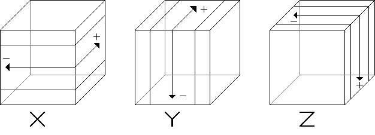

X, Y, and Z can be ANY centre slice. Simply change it as appropriate to the pieces you're working on.

The other notation was used in "Rubik's Revenge: The Simplest Solution" by William H. Mason, which is in the format x D y. x and y are vertical columns on the front face, starting at 1 on the left and N on the right. D is the starting direction to turn the bottom face, which is *always* a quarter turn, R(ight) for clockwise and L(eft) for counterclockwise. "Down" is the same direction as Y-, "Up" is the same direction as Y+. For example, 1 L 2's move sequence would be:
 
> Column 1 DOWN, bottom LEFT, coloumn 2 DOWN, bottom RIGHT, 
> column 1 UP, bottom LEFT, column 2 UP, bottom RIGHT.

To summarise, the columns *always* alternate with the bottom face, the first 2 column moves are *always* down, the last 2 are *always* up, and the bottom face *always* alternates directions, ie. it's either L, R, L, R, OR R, L, R, L.  Confused yet? :-) OK, if you are, try this pattern now:

> *1 R 2*: 
> 1 down, bottom right, 2 down, bottom left, 
> 1 up, bottom right, 2 up, bottom left.

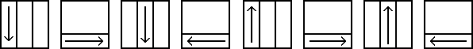
 
To get back to where you were before, perform the above pattern twice more. If you're still uncomfortable with the pattern, try a few more:

> *2 L 1*: 
> 2 down, bottom left, 1 down, bottom right, 
> 2 up, bottom left, 1 up, bottom right.

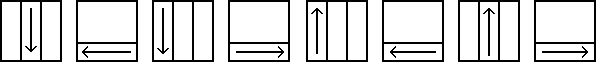

Each sequence of moves in this notation represents the (x, y) coordinates of the piece we're focusing on, with (1, 1) in the bottom left corner. For those of you not familiar with coordinate geometry that this means is that the bottom left corner is (1, 1), the piece to its right is (2, 1), the piece just above it is (1, 2), the (corner) centre piece beside both of these is (2, 2), etc. Or, put more simply, for coordinates (x, y) means count off x pieces to the right and y pieces up, counting the bottom left piece as 1 in both cases.  If this is confusing the heck out of you, here's a diagram to help you out, using the Professor's/Ultimate/Borg cube.

 Y  |  X 1  |  X 2  |  X 3  |  X 4  |  X 5
:-: | :---: | :---: | :---: | :---: | :---:
 5  | (1,5) | (2,5) | (3,5) | (4,5) | (5,5)
 4  | (1,4) | (2,4) | (3,4) | (4,4) | (5,4)
 3  | (1,3) | (2,3) | (3,3) | (4,3) | (5,3)
 2  | (1,2) | (2,2) | (3,2) | (4,2) | (5,2)
 1  | (1,1) | (2,1) | (3,1) | (4,1) | (5,1)

Along the way, I may refer to coordinates or a pattern with x or y instead of a number. Merely stick the needed number in place of the letter. For example, x L 1 could refer to 1 L 1, 2 L 1, 3 L 1, 4 L 1, or 5 L 1. Similary, 2 R y could refer to 2 R 1, 2 R 2, 2 R 3, 2 R 4, or 2 R 5. It just depends on what piece you need to move. N, as you've probably guessed, is merely the size of your cube, and N-1 is 1 less than the size of your cube. This heavily mathematical representation may seem to overcomplicate things, but trust me...  you'll end up thanking me later.

Solution Preface
================

During this solution process, you will undoubtedly come across several sections which simply don't apply to your cube, unless, of course, you've decided to take the plunge and engage the Borg. Simply skip over those sections until you come to something relevant. Here's a rundown of the various pieces and the minimal cube size which uses them, as well as the name of the sections dealing with them. Note that not all pieces are on all cubes above its minimal size.  All pieces with an odd minimum are *only* on odd sized cubes, while those with even minimums are on ALL cubes at least as big as the minimum size. For example, the corners are on all cubes, but the middle edges aren't on the Revenge, even though its minimal size is 3.  Note also that we skip the 6x6x6 and 7x7x7 in this diagram.

    Minimal Sizes      Glossary
	  2 4 3 4 2        1 2 3 2 1
	  4 4 5 4 4        2 4 5 4 2
	  3 5 3 5 3        3 5 6 5 3
	  4 4 5 4 4        2 4 5 4 2
	  2 4 3 4 2        1 2 3 2 1

Glossary Key:

1. Corners.
2. Edges.
3. Middle Edges.
4. Corner Cetres.
5. Edge Centres.
6. Middle Centres.

This should be easy enough to solve on your own by kludging at it for a while, but if not, I'll give you a few basic methods to kludge it together on your own.  If you have middle centre pieces on your cube, it's easier to keep everything straight, but if not, don't worry. Just pick a corner to define as "correct" and take it from there.

Top Corners
===========

If the corner you need to fix is on the bottom side of the cube, then move the bottom slice so it's directly below where it should go. If possible, hold the cube so that the corner's top colour is on the front side. Then, if it's on the

> Left side: perform D+ L+ D- L-. 
> Right side: perform D- R- D+ R+.

However, if the top colour is on the bottom side, hold the cube so the proper cubelet is on the left or right side.

> Left side: perform L+ D- L- F- D2 F+. 
> Right side: perform R- D+ R+ F+ D2 F-.

If the corner in question is in the right place, but oriented wrong, then hold the cube so that the corner's top colour is in the front. If it's on the:

> Left side: perform L+ D- L- D+ L+ D- L+. 
> Right side: perform R- D+ R+ D- R- D+ R+.

Right now, the top corners should have matching colours on each side. If not, just pretend any errant pieces are oriented incorrectly and go back to 1.  Pocket Cube users, you're almost done! Skip down (*waaaaaaay* down), to the [Bottom Corners](#bottom-corners), and leave the rest of us to suffer through the remainder of the solution. Original Cube users, drop down to the [Top Edges](#top-edges).

Top Centres
===========

If a centre piece belonging in the top layer is on a side other than the top or the bottom, then hold the cube so it's on the front side. Now rotate the top side until there's an incorrectly coloured centre piece (henceforth referred to as a "gap") in the same relative position, as in the image below.  Now perform X- Y- X+ Y+ OR X+ Y- X- Y+.

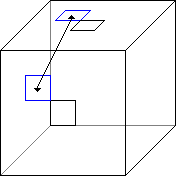

If the needed centre piece is on the bottom, then position it so that if you could look straight through the cube, the centres would match up as in the image below.  Perform Y- X- Y+ X- Z+ X+ Z- OR Y- X+ Y+ X+ Z- X- Z+.

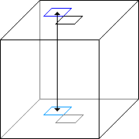

Top Edges
=========

If a top layer edge piece is on a *side edge* of the cube, then rotate its X layer until it's below its proper spot, and its top colour is on the front face, eg.

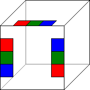

Now, if the piece is on the

> Left: perform X- F+ X2 F- 
> Right: perform X+ F- X2 F+

If, however, the edge piece in question is on a *bottom* edge of the cube, with the top side's colour on the *front* of the cube, then rotate the bottom layer until it's just below where it should go.

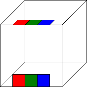

> Then perform F+ X+ F- OR F- X- F+

Finally, if it's on the bottom edge and the top colour's on the bottom, eg.

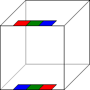

Then perform Y- D+ Y+ D- OR Y- D- Y+ D+ to change it so that now you can perform step 3 as above.  *Warning*: On the Rubik's Revenge and above, it may not be possible to perform this final step without scrambling an already corrected piece! If this happens, then you'll simply have to perform step 3 again for 2 pieces instead of just one.

The top side is now complete, and if you've done it right, you should have a solid ring of colour around the top edges. If not, move any errant edge pieces out of their current position and move them to where they should be, using the above tips.

Even numbered cube users, skip the next step and go onto the [Middle Edges](#middle-edges).

Middle Centres
==============

If your cube is and odd numbered cube and thus has a true centre on each side, then rotate the middle layer of the cube until the centres match the ring around the top layer. If you don't do this, you'll have plenty of headaches later when you come across "impossible" configurations and wonder how it could have possibly gone so horribly wrong.

Middle Edges
============

Flip your cube around now so that the bottom side becomes the front side.  From here on in, this solution will become *far* less verbose.

Find a piece you need to move and rotate the front side until its non-front side matches the colour of an adjacent side. Now rotate the cube until the side you want to move it to is on the bottom, eg.

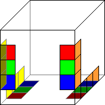

If the edge piece is on the:

> Left side: 1 R y 
> Right side: N L y

See? I told you this was going to get less verbose! :-)

Bottom Corners
==============

Welcome back, Pocket Cubers! For those of you who skipped over all the intervening stuff like I suggested, then rotate your cube until the bottom layer is now the front layer.

Unless the 4 corners are in the proper positions already or will be simply by rotating the front face (if they can be, do so now), then if possible, rotate the front face until there is only one cubie in the correct position.  Then, if the corners need to be rotated as:

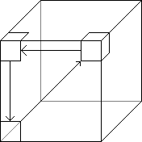 1 R N

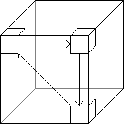 N L 1

Those of you who get either 0 pieces or 2 pieces in the proper place no matter how you rotate the front layer, rotate it until you get 0 correct, and then hold the cube so the pieces need to be swapped as seen below:

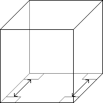

> Then perform R+ D+ F+ D- F- R- OR L- D- F- D+ F+ L+.

If you combine 1 R N and N L 1, rotating the cube to gain the correct alignment before performing the second part, *does not* end back with what you began as you might expect. Instead, it rotates 2 corner pieces. Either way, it rotates the top 2 corners by moving the top colour to the front. If this seems too cumbersome then move the front side back to the bottom again, and R- B- R+ B- R- B2 R+ B2 rotates all but the front left corner counterclockwise, B2 R- B2 R+ B+ R- B+ R+ rotates them clockwise. This also rotates 3 Rubik's Cube sized edge pieces and, if you have a picture cube, it also rotates the bottom centre by 180 degrees. At most, you will need to execute this pattern 3 times to orient all the corner pieces correctly.

Pocket Cubers, *you're done*! Jump down to [the bottom](#done) for a special message.

Bottom Edges
============

Of course, they're not really the bottom now, but that's beside the point. OK, here we go...

> Rotate (1, x), (x, 1), (x, N) clockwise: x L 1. 
> Mirror: x R N.

Eg. if you're using a Rubik's Revenge and x=2:

> Rotate (2, 1), (1, 2), (2, 4) clockwise: 2 L 1.

The mirror image would be:

> Rotate (3, 1), (4, 2), (3, 4) counterclockwise: 3 R 4.

To rotate the bottom and side centre edges, perform one of the patterns, flip the cube around so that the top is now the bottom, and then perform the other.  For bottom and left centres, start with the first pattern. For bottom and right, start with the second pattern (the mirror).

*All* combinations of edge pieces can be solved with these 2 basic patterns. If you're using the Rubik's Revenge or above and you've got one or more pairs of edge pieces left, then you truly know the meaning of the words "Rubik's Revenge". To solve for this special case, rotate one of the non-centred, middle layer slices a quarter turn, then solve for these middle layer edge pieces again. If you are using a 6x6x6 or above, make sure you rotate the proper layer!

Original Cubers, *you're done*! Join your Pocket Cubing companions at [the end](#done) for a special message.

Corner Centres
==============

If you encountered Rubik's ultimate revenge, then you know why this step was saved for last. If not, your time WILL come... trust me.

Rotate the front slice so that the necessary centre is over the a gap in the same relative position in the bottom layer, eg.

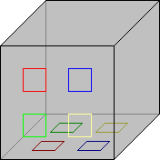

Now, if the corner is in the:

> Top left: 2 R N-1. 
> Top right: N-1 L 2. 
> Bottom left: 2 L N-1. 
> Bottom right: N-1 R 2.

Don't feel that you're forced to maintain the same front side at all times. If it's more convenient to use a different face as the front, then by all means, reorient the front and move the cube around as much as you want!  Rubik's Revengers: *revenge is yours*! Join your fellow Cubists and Pocket Cubists at [the end](#done) for a special message.

Edge Centres
============

The same thing applies here. If another side would be more convenient, then reorient and *move it around*! OK, people, we're into the final stretch. Again, get your edge centres lined up with an appropriate gap, eg.

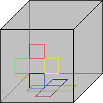

Then if it's at the:

> Top: 3 L 2 OR 3 R 4. 
> Left: 2 R 3 OR 2 L 3. 
> Right: 4 L 3 OR 4 R 3. 
> Bottom: 3 R 2 OR 3 L 4.

Whew! It's been a long haul, but you've just become *The Ultimate Cubist*! Join your fellow cubers who passed before you for a special message, and then invite them all over to party hearty!

CONGRATULATIONS!
================

You've just joined the ranks of the elite, and completed the ultimate revenge!  Give yourself a pat on the back. You deserve it! Heck, for completing these puzzles, you deserve a standing ovation! Before I go, here's a few patterns to try out.

For everyone: (L+ R+ F+ B+)^3

For original cubers and above:  (The "^2" means to do the part in parenthesis twice)

> L2 R2 U2 D2 F2 B2 
> U+ (R2 F2 B2)^2 U- (R2 F2 B2)^2

Try making your own, completely original patterns, or combine the ones above.  On the Rubik's cube or above, you can make all letters in the Roman alphabet.  On the Ultimate puzzle, you're able to make all of the Japanese katakana. Try spelling your name on the cube, or perhaps spelling the name of your favourite anime. By picking up your cube, you've opened up a door to a wondrous paradise of patterns that you've never experience before. The only limit to what you can create is your imagination.
