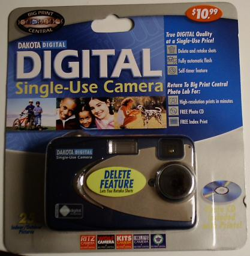
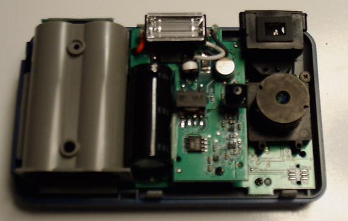
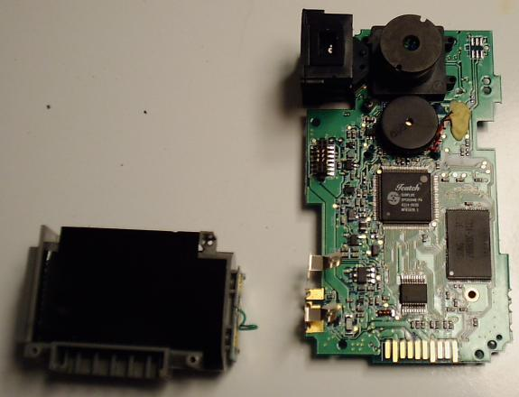
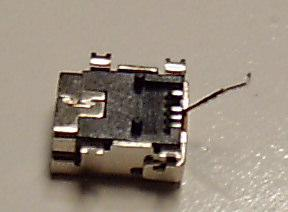
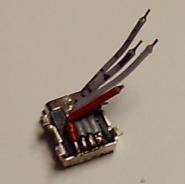
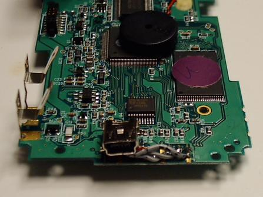
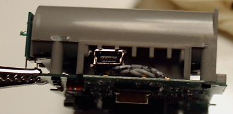
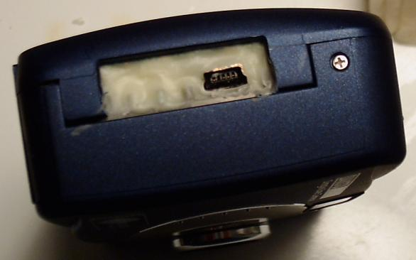
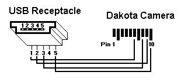

As is covered elsewhere on the net, Ritz is selling a "Dakota Digital Single-Use Camera" for about $11, and they want you to return it for processing (and they keep the camera at this point) for another $11.  You get a CD with the images and a printed index.

To be able to download the photos yourself would be very nice, so wonderful people have put together many sites on the subject.  This one will just show the steps required to stick a mini-USB port in the camera with as little modifications as possible.  With the USB port, you can use [this software](dakota-software.zip) to download the pictures from your camera and erase them from the camera's memory.

Specs
-----

* Weight: 5.3 oz
* Size: 4" x 2.6" x 1.5"
* Image Resolution: 1280 x 960
* 1.31 Megapixels
* 10 second timer
* Flash
* 16 megs SDRAM
* 2 x AA batteries
* Can store 25 pictures

Things I Have Done
------------------

I have taken the information from other places on the web and just took it a tiny step further.  I altered a set of cameras to have a standard mini-USB port on it, then sealed the deal in epoxy to make it a solid, durable, cheap camera.  This thing is great for kids, espeically since everything costs under $20 and the kids can download pictures on their own.

From here on, I'll be instructing you to do the same thing as what I've done.

Step 1: Get The Equipment
-------------------------

You will require the following parts:

* *Dakota Digital Camera* - Get it from Ritz.  You'll need to walk into a store to order it because the web site doesn't sell them.  I have not tested the one from Walgreens, but it is said that they use slightly different hardware.
* *Ribbon Cable* - You will need about 2 inches of it with at least 4 wires.  Feel free to chop up a spare IDE cable or something.
* *USB Mini-B Receptacle* - This is what the USB cable will plug into.
* *Mini-USB Cable* - Standard end on one side, mini-USB plug on the other.  (See below)
* *Epoxy* - Something that bonds with metal and plastic.  Super Glue's
Plastic-Fusion works great, but try to get some slow setting stuff if you
can.

If you don't have the Mini-USB cable already, don't get one from a major retailer.  I suggest searching line or in an electronics store.

Step 2:  Take Pictures
----------------------

Take a couple pictures.  They will be needed when you have the camera apart and you want to test downloading images.  Have at least 1 picture in the camera's memory.

Step 3:  Prepare Camera
-----------------------

Disassemble the camera.  I'd even suggest you unsolder the wire from the battery compartment so you don't need to worry about it flopping around when you work.  It won't be needed until you put the camera back together again.  Put a little solder on the gold contacts that you will be using (see the schematic below).  If the solder won't stick, you should scuff up the gold contacts a bit.  Just scratch them with a sharp piece of metal, or rub fine grain sandpaper on them.  You only need to create a small bit of texture so the solder will stick to the metal.  Alternatively, I have read that you can use some conductive silver paint.

Step 4: Prepare the Receptacle
------------------------------

You can just rip out the unused pin so you don't need to worry about accidentally soldering stuff to it.  Doing so will give you more space for soldering the other wires.  It is pin 4 on the receptacle.  See the diagram near the bottom of this page or the photo below to determine which wire to rip out.  Take your time with this step.  Do not pull out the wrong wire!  If you are a bit timid, you can bend the wire out of the way, solder the rest, and once it works you can choose pull out the wire then, or just leave it as is.  Also, this is the time to dab a bit of solder on the leads for the receptacle to make the next step go a bit faster.

Step 5:  Solder
---------------

Time to solder the wires onto the other parts.  Cut, strip, put a bit of solder on the ends, then press the wire to the USB lead or the gold contact, heat and pray that it works.  With the different wires that I have tried, ribbon cable seems to work the best.  The stranded wire is very flexible and sucks up solder readily.  Refer to the wiring diagram to make sure you get the wires going to the right spots on the camera.

Step 6:  Test
-------------

Hook it up to your computer.  Get [the software](dakota-software.zip) running.  The zip file has necessary Windows drivers and software.  If it doesn't work, then you did something wrong and should double check your solders.  Refer again to the wiring diagram, make sure that the wires did not come off of the camera, and make sure you soldered the USB receptacle correctly.  It took me forever to get this stuff soldered properly.  (Not sure if I should admit that.)  Most of the time a wire came off the itty bitty USB receptacle.

Step 7:  Modify Battery Case
----------------------------

To get the USB connector securely situated, I cut a tiny bit from my battery case.  This way the USB connector was flush with the circuit board and was held down by the rest of the battery case.

Step 8:  Assemble
-----------------

Screw on the battery case, push the wires around so they fit in the proprietary connector, and test again.  If it doesn't work, go back and see what went wrong.  You will also need to make sure that the USB receptacle does *not* touch the other pads on the camera's circuit board.  Use a spare piece of plastic, or a hunk of ribbon cable, or anything.  Keep the USB port away from the other contacts.

Step 9:  Epoxy
--------------

Any receptacle on a device can go through tons of stress.  I securely epoxied my USB receptacle and wiring to the battery case and the circuit board.  This means that it's all set in stone now, but I shouldn't need to open the camera up again.

Step 10:  Done?
---------------

Test again, and you may be out of luck if it does not work.  Try to test while the epoxy has not yet set, so if it does not work, you can rip the parts out as fast as possible.  (I already lost 1 camera at this step.)

Assuming it works, then just wait and finish the reassembly.

Wiring Diagram
--------------

    USB Pinout            Camera Pinout

    Pin  Color  Purpose   Pin  Signal
    -------------------   -----------
     1   Red    +5 v       1   R57, not stuffed
     2   White  Data -     2   Ground (battery -)
     3   Green  Data +     3   R18-via-r68-r47
     4   Key    Unused     4   R25, not stuffed
     5   Black  Ground     5   R5 (1k ohm)
                           6   5v in from USB (red wire)
                           7   Ground
                           8   USB Data + (green wire)
                           9   USB Data - (white wire)
                          10   USB Ground (black wire)

Some people report that sending the ground to pin 7 instead of pin 10 works better for them.

Links
-----

[Referend Jim](http://revjim.net/2003/07/30/disposable-digital-camera/) - Lots of information about how the Ritz camera was usably hacked and all about the hardware.

[Windows Software](http://cexx.org/dakota/) and information about the camera.

[Dakota PV2 Series](http://www.cexx.org/dakota/pv2.htm) information (the one with the LCD)

