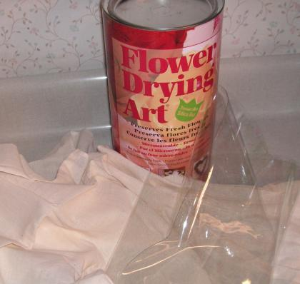
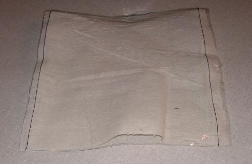
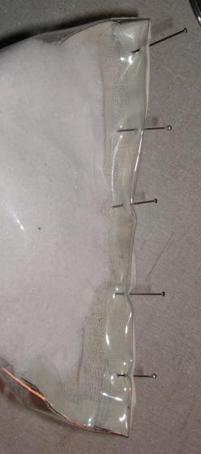
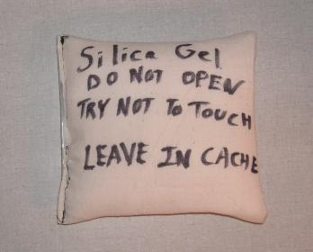
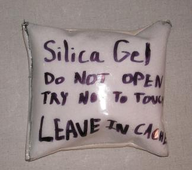

I have a geocached called the [Watertown Area History Cache](http://www.geocaching.com/seek/cache_details.aspx?wp=GC128DJ).  The container is quite large and had a problem of moisture getting into the box, causing rust and the possibility of mold to start growing on the log book.  I planned this cache for nearly two years, so that was unacceptable.  I wasn't about to have the cache container ruined!  Someone told me about desiccants, which will absorb moisture, and suggested I check out a marine supply shop.

I searched on the web and determined that it would be more effective if I were to just make my own.  Because I did not see many other sites out there that said how to do this, I also wrote up this page to help others.

Background
----------

A desiccant (or sometimes misspelled as a dessicant) is a material that removes moisture from the air.  It does this through a process called adsorption.  No, not absorption.  There is a tiny difference:  materials that absorb water literally take it into themselves, but materials that adsorb water just have the water molecules stick to the surface.

Most of the desiccants you find on the web today use silica gel as the main agent.  Some may use clay and others use different chemicals.  Silica gel is often used by crafters to dry flowers quickly.  You can also use borax (check the laundry aisle in your local store) and other chemicals.  I've read that silica performs really well and can adsorb moisture pretty fast, plus you can get indicator crystals that tell you when the silica has adsorbed as much as it can hold.  From what I have read, silica gel can hold up to 30% of its weight in water.  It can also be recharged and reused by sticking it in an oven (see below).

These instructions can let you build a desiccant container, desiccant bag, or other similar device.  Heck, you can just put the silica gel into a paper cup and that may be good enough.

Warnings
--------

If you can't sew or use sharp objects, just stop here.

Silica gel is pretty harmless.  If you try to not breathe the dust and if you wash your hands after use, you should basically be safe.  If you start coughing, you're probably breathing in too much dust.  A chemical sheet on silica gel would say the following:

> May cause mechanical irritation to the eyes and skin.
> May cause irritation of the digestive tract if ingested.
> Dust is irritating to the respiratory tract if inhaled.
> Prolonged exposure to inhaled dust may cause delayed lung injury/fibrosis (silicosis).
> [More Information](http://www.atmos.umd.edu/~russ/MSDS/silicagel28200.html)

But really, the stuff is pretty darn safe, otherwise I would certainly not use it in my geocache.

Materials Needed
----------------

These instructions tell you how to create a desiccant bag.  Other tips are listed below in case you want a container or something else.  The bag made in this process has a vinyl side so you can see the indicator crystals and know when you need to "recharge" your reusable bag.

* Silica Gel - You can get this from your local hobby store.  It is used for drying flowers.  Make sure to get "indicator crystals" in with the silica.  They will turn from blue to pink, telling you when you need to recharge your desiccant bag.  Also, silica gel comes as particles, not as an actual gel.

* Cloth - I have some muslin in the picture, but you may wish to have something a little more dense.  Perhaps an old cotton shirt would work.  You do not want to let the silica out.

* Vinyl - I have some medium weight vinyl, which will let me see the indicator crystals on one side of my bag so I know how much moisture was adsorbed.  You can use cloth on both sides if you do not intend to look at the colored bits that indicate how much water was absorbed.

* Sewing Machine - If you can't operate one, then find someone who can.  This is just a basic pocket or bean bag, so you can hand sew it if you like.

Create a Pocket and Fill It
---------------------------

 

You want to make a pocket.  It's really simple.  Just take two squares, rectangles, circles, or whatever shape you like.  I used squares.  Next, sew it on three sides.  You want a large enough opening to be able to flip the pocket inside out and to fill it with silica.  If you have a pattern on the fabric, or a "finished side" you want to see, make sure that the finished side is on the INSIDE of the pocket.

Turn the pocket right side out.  The vinyl may make this difficult, but I am sure you can do it.

Fill the bag with silica.  Leave some space near the top so you can have an easier time sewing the top shut.  I actually filled this bag too full, and that made things very hard when sewing that last side.

Fold in your top side and pin it shut.  Sew.

Finished Product
----------------

 

I made this packet that has cloth on one side and vinyl on the other.  It is going into a geocache and I just don't want to have to worry about kids eating the thing, so I put the warning messages on both sides.  If you get the enlarged version of the vinyl side, you can maybe see these tiny blue specks in the white particles, which will turn pink by the next time I see them.

Other Tips
----------

If you want to make a container of sorts, you first need to find one that can hold the silica gel without letting too much leak out.  I used old Gladware cheap food storage containers.  Just pour in the silica gel and poke several holes in the top to allow for air exchange.  The more air that can be exchanged, the better it will be, but you may also start to lose these particles if you shake or tilt your container.

You don't really want a super thick layer of the silica gel because moisture will have a hard time getting down to the bottom ones.  It would be better to create several thinner bags and stack them on some sort of wire shelf or suspend them.

Silica gel is reusable!  This counts even for those little packets of silica gel that you find in new luggage, camping gear, shoes and many other consumer goods.  Just place your container in your oven at 250° F (120° C) and wait several hours.  I have heard it takes from three to five hours, and you will want to have all of the indicator crystals turn blue again.  Don't turn it up too hot or you may ruin your container, destroy the silica gel, or start your house on fire.
