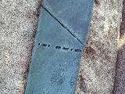
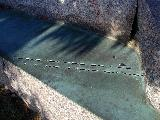
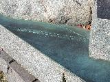
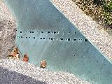
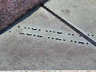
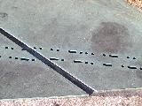
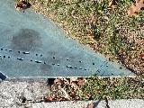
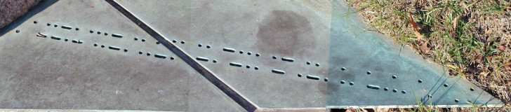

Sanborn's description (from [Elonka's website](https://elonka.com/kryptos/KryptosAerial.html):

> ...the first of three elements of this work. We see a large "natural" stone
> outcropping running parallel to the facade, through which the main walkway
> passes. This outcropping is composed of 12" - thick slabs of granite. Between
> two of these layers is a "seam" in geological terms of green copper plate.
> The top of this plate which is exposed in several places is perforated with
> International Morse code, the simplest of all codes. This text can be
> deciphered easily by those familiar with Morse.

To decode Morse code, you are welcome to try out [my tool](../../../tools/cipher/morse/).

Morse code prosigns are shown with a bar above, like `SOS`. When you send a prosign, you omit the pause between the letters, which is normally the same amount of time as three dits.

When I saw the larger gaps that appear between words, I flagged them in the transcoded messages as a `/` below. When transmitting Morse code, these pauses should be the same amount of time as seven dits.

I have once seen a reference that said the repeated `E` code (`.`) was a way that an operator would pause a message without relinquishing control. Unfortunately, I have lost that website and can't seem to find another that would support this conclusion. Other theories believe these characters could be crucial for decoding [K5](../k5/)

These messages are read from the rock to the edge as "forward" because the other direction is consistently unintelligible. Some of the pictures referenced will show the Morse code backwards. One of the messages is cut backwards and feeds into the rock, and that one is called out in the analysis.

There are a couple places where the Morse code could be interpreted as having an error. Sanborn has said some errors are intentional when asked about [K1](../k1/) and [K2](../k2/), so perhaps there are intentional errors in this portion as well.

## SOS

 Images copyright Jim Gillogly, 1999, and mirrored from [his website](http://www.voynich.net/Kryptos/).

<tt>
...---...
</tt>

One line of Morse code. Some sources online don't see the dot on the left, barely peeking out underneath the stone. `...` is `S` and `---` is `O`. Lots of people put spaces between the letters, making `... --- ...`, but that is incorrect. The `SOS` prosign is sent without larger gaps between the letters.

### Other direction

<tt>
...---...
</tt>

This is a palindrome and there's no backwards interpretation of these letters.

## RQ / YR

 Images copyright Jim Gillogly, 1999, and mirrored from [his website](http://www.voynich.net/Kryptos/).

<tt>
.-. --.-
</tt>

When read left to right, this produces `RQ`. The code `.-.` could also be shorthand for the prosign `ROGER`. The code for `Q` at the end is right at the edge, so it could also be a partial code for `Ĝ` (`--.-.`) or `Ñ` (`--.--`), though I think it is unlikely.

An interesting bit about `RQ` comes from [A Guide to Morse Code Proficiency](http://norfolkamateurradio.org/pdf/A_Guide_to_Morse_Code_Proficiency_v1.pdf), though I don't know if Sanborn would have researched transmission of Morse code this thoroughly.

> If the transmitter is slow to start transmitting *e.g.* a slow mechanical transmit-receive changeover relay), the first mark is truncated and may even be completely lost, changing the meaning of the first character. A callsign such as EA4ABC may become A4ABC, for instance, or a "CQ" call may start with "FQ" or "RQ".

For reference, `CQ` is a prosign but the space between the letters is preserved (though some sources disagree). Think of it as a shortcut and means "I would like to make a contact, does anybody hear me?" The code for C is `-.-.` and `R` code is `.-.`, but the pictures show plenty of space before the `R` to indicate that the correct message is likely `RQ` or its an error in transcription.

### Other direction

<tt>
-.-- .-
</tt>

When read the other direction, this produces `YR`. Again, the code for `Y` could be cut off and `Ñ` (`--.--`) could be the first letter.

## LUCID MEMORY

 Images copyright Jim Gillogly, 1999, and mirrored from [his website](http://www.voynich.net/Kryptos/).

<tt>
.-.. ..- -.-. .. -.. / . / . / . 
/ -- . -- --- .-. -.-- / . /
</tt>

The first line reads `LUCID E E E`. The code for `L` is extremely close to the rock so it could be `Ć`, `Ĉ`, or `Ç` (all have the code `-.-..`); or maybe `Đ`, `É`, or `Ę` (all have the code `..-..`).

The second line reads `MEMORY E`. The gap to the beginning of `M` is clearly present, so no alternate interpretations are available.

### Other direction

<tt>
/ . / --.- .-. --- -- . -- / 
. / . / . / ..- .. .-.- -.. ..-.
</tt>

If reading the lines from the other direction, `MEMORY E` becomes `E QROMEM`.

Reading the other line backwards produces `E E E UIÄDF`. Instead of `Ä`, the code `.-.-` could mean `Æ`, `Ą`, or is shorthand for either "new line" or "unknown station". The `F` at the end could instead be `Đ`, `É`, or `Ę` (all have the code `..-..`); or the prosign `INT` (code `..-.-`), which means "interrogative" and is a military replacement for a question mark.

## SHADOW FORCES

 Images copyright Jim Gillogly, 1999, and mirrored from [his website](http://www.voynich.net/Kryptos/).

<tt>
. / . / ... .... .- -.. --- .-- / . / . 
..-. --- .-. -.-. . ... / . / . / . / . / .
</tt>

The first line is `E E SHADOW E E`.

The second line is `FORCES E E E E E`.

### Other direction

<tt>
. / . / . / . / . / ... . .-.- .-. --- .-.. 
. / . / --. --- ..- -. .... ... / . / .
</tt>

When read from the other side, `FORCES E E E E E` would translate into `E E E E E SEÄROL`. Instead of `Ä`, the code `.-.-` could mean `Æ`, `Ą`, or is shorthand for either "new line" or "unknown station".

The second line would change from `E E SHADOW E E` to `E E GOUNHS E E`.

## WHAT IS YOUR POSITION

 Images copyright Jim Gillogly, 1999, and mirrored from [his website](http://www.voynich.net/Kryptos/).

<tt>
- / .. ... / -.-- --- --. .-. 
.--. --- ... .. - .. --- -. / .
</tt>

The first line appears to say `T IS YOUR`. The `T` at the beginning might just be the end of a code, though people naturally leap to the whole word `WHAT`, though it could just as easily be a `K` like `BACK IS YOUR`. When taken with the second line, it's hard to dispute that `WHAT IS YOUR` is correct.

The second line looks like `POSITION`. The last dah in `O` and the first dit in `S` are obfuscated by rock, though the spacing is right for these letters. The beginning `P` may be `(` or an invitation to transmit (code `-.--.`); or `Ð` (code `..--.`). Also, the `E` at the end is trimmed, so it's often overlooked.

### Other direction

<tt>
. / .- --- .. - .. ... --- .--. 
.-. .-- --- --.- / ... .. / -
</tt>

If read from the other side, we start with `E AOITISOP`, but with the same caveat that a dit and a dah are covered by rock. The final `P` could be `@` or the prosign `AE` (code `.--.-.`), `À` or `Å` (code `.--.-`), or `Þ` (code `.--..`).

The next line is `RWOQ T`, again with the note that `T` could be just the beginning of a code.

## DIGITAL INTERPRETATION

 Images copyright Jim Gillogly, 1999, and mirrored from [his website](http://www.voynich.net/Kryptos/).

<tt>
. / -.. .. --. . / - .- .-.. / . / . / . 
.. -. - . .-. .--. .-. . - .- - ..-
</tt>

The first line literally reads `E DIGE TAL E E E`. The extra space after the `E` in `DIGE`, when taken literally, indicates that this is the end of a letter. However, it has enough of a gap to nicely put in another dit, which would make the message `E DIGITAL E E E`. Is this error intentional?

The second say `INTERPRETATI` and is cut off. It looks like just enough metal is left after the final `I` to indicate that there's a gap as opposed to another code that starts with a dah, such as N (code `-.`).

### Other direction

<tt>
-.. - -. - . .-. .--. .-. . - .- .. 
. / . / . / ..-. -. - / . .-- .. ..- / .
</tt>

If read from the other side, the top line would read `TITNTERPRETAI`. It's curious how closely this matches the other direction.

The second line would be `E E E FNT EWIU E`. If we add the dit that is assumed to be missing, we get `E E E FNTIWIU E`.

## VIRTUALLY INVISIBLE

 Images copyright Jim Gillogly, 1999, and mirrored from [his website](http://www.voynich.net/Kryptos/).

 This one image is the other three stitched together.

This cipher message is cut into two plates and is the only one that reads *towards* the rock. The rest are read away from the rock and do not span any gaps. This cipher transcription uses a vertical bar to show where the gaps are in the Morse code, but this reads nicely when you join the plates together as though the gap isn't there.

<tt>
. / . / ...- .. .-. - ..- .- | .-.. .-.. -.-- . 
. / . / . / . / . / .. -. ...- .. ..|. .. -... .-.. . /
</tt>

The first line is `E E VIRTUALLYE`. The gap is between the `A` and `L`. The extra `E` at the end doesn't have a larger inter-word gap, so it should be considered part of `VIRTUALLY` or else it is a transcription error.

The second line is `E E E E E INVISIBLE`, where the letter `S` spans the gap.

### Other direction

<tt>
/ . ..-. ...- .. . | .. .. -... .- .. / . / . / . / . / . / . 
. --.- ..-. ..-. | -. -.. - .-. .. -... / . / .
</tt>

The first line reads `EFVIE|IIBAI E E E E E` if you stop at the gap, or `EFVISIBAI E E E E E` if you join the letters across the gap.

The second line is `EQFF|NDTRID E E`, where the gap doesn't appear to interfere with the codes.
