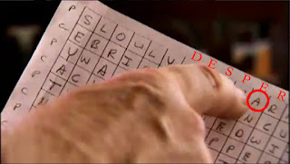

The lower portion of the Kryptos cipher text looks like this. It is unclear if the question mark is part of K3, [K4](../k4/), a separator, or a flag for [K5](../k5/). Note that there are three letters that are raised above the others, which are indicated in **bold** in the cipher text.

<tt>
END<b>YA</b>H<b>R</b>OHNLSRHEOCPTEOIBIDYSHNAIA 
CHTNREYULDSLLSLLNOHSNOSMRWXMNE 
TPRNGATIHNRARPESLNNELEBLPIIACAE 
WMTWNDITEENRAHCTENEUDRETNHAEOE 
TFOLSEDTIWENHAEIOYTEYQHEENCTAYCR 
EIFTBRSPAMHHEWENATAMATEGYEERLB 
TEEFOASFIOTUETUAEOTOARMAEERTNRTI 
BSEDDNIAAHTTMSTEWPIEROAGRIEWFEB 
AECTDDHILCEIHSITEGOEAOSDDRYDLORIT 
RKLMLEHAGTDHARDPNEOHMGFMFEUHE 
ECDMRIPFEIMEHNLSSTTRTVDOHW?
</tt>

This can completely be decoded using a [double columnar transposition](../../../tools/cipher/double-columnar-transposition/) cipher, where you arrange the cipher text into lines that are 21 characters long and read down the columns, starting from the right and working towards the left. Then you do it again by arranging the rows into lines 28 characters long and again read down the columns from the right to the left.

When decoded, you will see this message.

<tt>
SLOWLYDESPARATLYSLOWLYTHEREMAINS 
OFPASSAGEDEBRISTHATENCUMBEREDT 
HELOWERPARTOFTHEDOORWAYWASREMOV 
EDWITHTREMBLINGHANDSIMADEATINY 
BREACHINTHEUPPERLEFTHANDCORNERAN 
DTHENWIDENINGTHEHOLEALITTLEIIN 
SERTEDTHECANDLEANDPEEREDINTHEHOT 
AIRESCAPINGFROMTHECHAMBERCAUSED 
THEFLAMETOFLICKERBUTPRESENTLYDETA 
ILSOFTHEROOMWITHINEMERGEDFROM 
THEMISTXCANYOUSEEANYTHINGQ?
</tt>

Adding spaces and punctuation will produce this paragraph. Note that "desperately" is misspelled as `desparatly` in the plain text.

> Slowly, desparatly slowly the remains of passage debris that encumbered the lower part of the doorway was removed. With trembling hands, I made a tiny breach in the upper left-hand corner and then, widening the hole a little, inserted the candle and peered in. The hot air escaping from the chamber caused the flame to flicker, but presently details of the room within emerged from the mist. X Can you see anything Q ?

What I don't like about it is "Kryptos" isn't used during the deciphering. Also, the NSA solution says the text was encoded by a keyed columnar transposition technique with an incompletely filled matrix size 4 x 86. [Another source](https://web.archive.org/web/20090605075608/http://www.cryptofone.com/kryptos3.html) uses the word `KRYPTOS` as a columnar transposition key, but first reverses text, splits into chunks, stacks the chunks, then applies the columnar transposition. If I were to bet, my money would be on this last solution - I think it's either close or the same as what Sanborn used.

A [page with hints](http://scirealm.org/KryptosHints.html) says "Sanborn commented that he was surprised that no one had tried recovering the original matrix and running it through all the possible 'shifts'." Also, "When showed the part 3 KRYPTOS=0362514 number key, he nodded as though he recognized it," and "He thought Elonka's solution for part 3, with clean diagonals, must be 'a by-product of the original matrix system'."

## Threads

 Images copyright Dailymotion, from [their video](https://www.dailymotion.com/video/x35x1vc) at 4:16.

The plain text clearly says `DESPARATLY` - was that a typo on the author's part or an intentional change? Nothing has been confirmed on this error, though the plain text seen in the video, along with [some deduction](http://numberworld.blogspot.com/2018/07/kryptos-cipher-part-3.html) does indicate that the plain text originated with the two spelling errors.

The passage is paraphrased from Howard Carter's description of opening the second doorway leading into the antechamber of the tomb of King Tut in 1922. It reads as follows.

> Slowly, desperately slowly it seemed to us as we watched, the remains of passage debris that encumbered the lower part of the doorway were removed, until at last we had the whole door clear before us. The decisive moment had arrived. With trembling hands I made a tiny breach in the upper left hand corner. Darkness and blank space, as far as an iron testing-rod could reach, showed that whatever lay beyond was empty, and not filled like the passage we had just cleared. Candle tests were applied as a precaution against possible foul gases, and then, widening the hole a little, I inserted the candle and peered in, Lord Carnarvon, Lady Evelyn and Callender standing anxiously beside me to hear the verdict. At first I could see nothing, the hot air escaping from the chamber causing the candle flame to flicker, but presently, as my eyes grew accustomed to the light, details of the room within emerged slowly from the mist, strange animals, statues, and gold - everywhere the glint of gold. For the moment - an eternity it must have seemed to the others standing by - I was struck dumb with amazement, and when Lord Carnarvon, unable to stand the suspense any longer, inquired anxiously, "Can you see anything?" it was all I could do to get out the words, "Yes, wonderful things." Then widening the hole a little further, so that we both could see, we inserted an electric torch.

Lady Evelyn was Lord Carnarvon's daughter. Callender was an assistant.

## Open Questions

* Why are the letters `YA` and `R` in the first line raised up a little?

* Should the third line read <tt>TPRNGATIHNRARPESLNNELEBLPII<b>E</b>CAE</tt> to fix the spelling error in `DESPARATELY`?
