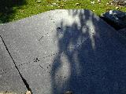
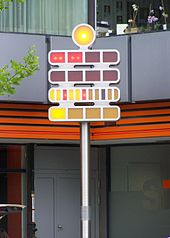

On Kryptos, the last 97 characters look like this.

<tt>
                           OBKR 
UOXOGHULBSOLIFBBWFLRVQQPRNGKSSO 
TWTQSJQSSEKZZWATJKLUDIAWINFBNYP 
VTTMZFPKWGDKZXTJCDIGKUHUAUEKCAR
</tt>

Sanborn has mentioned that the length is indeed 97 characters in [an interview](https://www.npr.org/2020/01/30/801323608/a-new-and-final-clue-to-kryptos-a-long-standing-puzzle). He's also given [several clues](https://elonka.com/kryptos/) and confirmed that the letters [directly map](http://numberworld.blogspot.com/2018/07/kryptos-cipher-part-3.html) from the cipher text to the plain text. From this, we know the following letters are correct in the message. Perhaps this is to cut down on the number of people mailing him thousands of incorrect solutions.

It is possible that the first `EAST` in the plain text isn't correct. Sanborn did confirm it, but it's possible that it was confirmed out of hand as opposed to being intentional. He previously leaked `NORTHEAST` and a member of the Kryptos group asked him about `EASTNORTHEAST` being in a specific location and Sandborn confirmed it.

<tt>
                           .... 
.................EASTNORTHEAST. 
............................BER 
LINCLOCK.......................
</tt>

If we trust Sanborn, then we can assume this is not a transposition cipher, though perhaps that's [not right](https://kryptools.com/hints.htm).

> Quotes from a March, 2019 lunch by Elonka: We spent quite a bit of time
> asking Jim about the correlation between the plaintext BERLIN and the
> ciphertext such as NYPVTT. Specifically, we were trying to find out if there
> was a 1:1 relationship from NYPVTT to BERLIN, or there was some other step,
> the masking technique. Jim was confused when we mentioned masking technique,
> evidently it's something that Ed said that Jim didn't understand. Jim said
> that yes the ciphertext and plaintext were connected, but when I tried to
> explain what exactly we were asking, like that in K1 EMUFPH is exactly
> BETWEE, but in K3 ENDYAH does not map exactly to SLOWLY, Jim backed off and
> said he would only commit to the fact that K4 is exactly 97 characters long,
> and that BERLIN is plaintext that starts at exactly the 64th character, but
> he wouldn't go further than that.

The cipher method probably doesn't involve math. Sanborn admitted he's bad at math during [an interview](https://www.npr.org/2020/01/30/801323608/a-new-and-final-clue-to-kryptos-a-long-standing-puzzle), and had this to say at a different interview.

> And Ed basically gave me—he gave me a primer of ancient encoding systems. And
> he also gave me some ideas for contemporary coding systems, more
> sophisticated systems, systems that didn't necessarily depend on mathematics.
> That was one of my prerequisites. So he told me about matrix codes and things
> like that. These are the parts of Kryptos that have already been cracked. So
> I can discuss them. But he told me about coding systems that I could then
> modify in a myriad of ways. So that even he would not know what it says.
> Okay? So that was very seductive to me. And so I took those things. We met
> two or three times. And that's what I based the whole thing on.

## Threads

 Images copyright Jim Gillogly, 1999, and mirrored from [his website](http://www.voynich.net/Kryptos/).

`EASTNORTHEAST` is the same direction as the compass etched into a stone located in the same area as the bent metal shape that most consider to be Kryptos. Sanborn considers the whole installment to be Kryptos.

 Images by Muritatis, public domain, mirrored from [Wikipedia](https://commons.wikimedia.org/w/index.php?curid=4474854).

The clock in Berlin is a special clock that inspired Sanborn. It shows the time using lights in base-5. When asked about this clock, Sanborn said, "There are several really interesting clocks in Berlin." He added, "You’d better delve into that particular clock."

Elonka Dunin received an anonymous clue as an instant message:

> MolleeH [3:29 PM]: The key to Kryptos is "komitet."

There's also a [lot of information](http://numberworld.blogspot.com/2018/07/kryptos-cipher-part-3.html) over at Number World. Kryptools tracks [more hints from interviews](https://kryptools.com/hints.htm).

## Open Questions

* Do the misspelled words in [K1](../k1/) and [K2](../k2/) figure into this cipher, or are they for [K5](../k5/)?

* The Vigenère tableau on the other side of the Kryptos sculpture has an extra letter `L` at the end of one of the lines. If you read down the last column, you can see the word `HILL`. Is that a hint towards a Hill Cipher?
