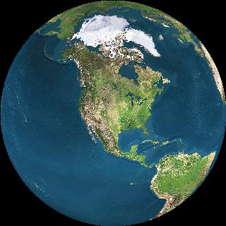
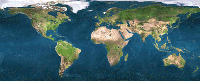

    

        
    

    

        
        <MAP NAME="map1">
            <AREA SHAPE="POLY" COORDS="174,35,163,44,151,46,162,72,196,76,198,47" HREF="javascript:GoTo(4)">
            <AREA SHAPE="POLY" COORDS="126,0,141,45,163,40,183,18,196,15,196,2"    HREF="javascript:GoTo(3)">
            <AREA SHAPE="POLY" COORDS="136,35,124,4,105,3,93,13,87,30,93,47,103,53,110,74,124,67,136,53" HREF="javascript:GoTo(2)">
            <AREA SHAPE="POLY" COORDS="67,38,48,44,53,78,70,79,88,50,77,39" HREF="javascript:GoTo(1)">
            <AREA SHAPE="POLY" COORDS="92,1,88,12,65,34,45,44,23,24,4,19,1,1,92,1" HREF="javascript:GoTo(0)"> 
        </MAP>
    

    

        <a href="javascript:GoTo(0)" style="color: yellow; text-decoration: none">North America</a> 
        <a href="javascript:GoTo(1)" style="color: yellow; text-decoration: none">South America</a> 
        <a href="javascript:GoTo(2)" style="color: yellow; text-decoration: none">Africa &amp; Europe</a> 
        <a href="javascript:GoTo(3)" style="color: yellow; text-decoration: none">Asia and Russia</a> 
        <a href="javascript:GoTo(4)" style="color: yellow; text-decoration: none">Australia</a> 
        <a href="javascript:SpinGlobe()" style="color: yellow; text-decoration: none">-- Spin Globe --</a>
    

    

    

    <h1 align=center>Loading ...</h1>
    
Please wait for the world to revolve once so the world gets loaded.

    <h1 align=center>North America</h1>
    <h2>Navigation</h2>
    
Just click on the globe to the left or the stretched out globe in the
    lower left.  The globe will rotate and this frame will refresh.

    <h2>Download</h2>
    
If you use this code, I'd appreciate credit in your JavaScript.
    You can either save this page and all of the images that it uses, or I
    have a <a href="geonav.zip">slightly older version</a> as a zip file.

    
<a href="#" onclick="LoadNav('credits'); return false">Credits</a>

    <h1 align=center>South America</h1>
    
Insert links for South America here

    
If you get creative, you can use this type of thing to showcase links
    about a single city, country, or other geographic region.

    <h1 align=center>Africa and Europe</h1>
    
Insert links relative to these areas here.

    
If you get extremely creative, you could write a program that does a
    bubble-zoom effect on a network of nodes, and use the images that were
    created in here instead of using pictures of a globe.

    <h1 align=center>Asia</h1>
    
Insert links relative to Asia here.

    
I tried using higher quality pictures, but they slowed down the browser
    too much.  I also tried having a path from where you were directly to where
    you were going, but that was a huge amount of images.

    <h1 align=center>Australia</h1>
    
Insert links relative to Australia here.

    
For added flashiness, you could rewrite this type of idea in Flash.  I
    bet it would be easier if you could make a sphere, put a globe texture on
    it, and then just spin the ball wherever you like.  Zooming, bouncing, and
    some warping effects would make the globe seem nicely animated.

    <h1 align=center>Credits</h1>
    <UL>
    <LI>Images are generated by the <A
    HREF="http://www.fourmilab.ch/earthview/">Earth Viewer</A> by
    <A HREF="http://www.fourmilab.ch/">John Walker</A></LI>
    <LI>Satellite data that Earth Viewer uses is from
    <A HREF="http://livingearth.com/">The Living Earth</A></LI>
    <LI>Positioning on the globe was done with a shareware Windows program,
    <A HREF="http://www.amiglobe.com/">Amiglobe 99</A> </LI>

