----
title: Cleaning Whiteboards
template: index.jade
js: /js/jquery-1.9.1.min.js /js/jquery.tablesorter.min.js /js/tablesorter-start.js
----

People have all sorts of different tricks that they use to clean a whiteboard.  Some things work well for whiteboard markers.  Other methods are better for marks by markers that are not dry erase.  I decided to finally put all of the rumors and tips to the test.

I took several higher-quality photos during the test.  You can view the [whiteboard testing photo album](https://plus.google.com/photos/100011361216949115069/albums/6080979911880611553?authkey=CJHR_MTshuaXFA) for better versions of the images below.

Test Preparation
================

I sacrificed my large, commercial whiteboard and coated it with the following materials:

* Dry erase marker (three different brands, various colors)
* Wet erase marker (one brand)
* Permanent marker (four different brands, various colors)
* Crayon (one brand, several colors)
* Pencil (standard #2 and colored pencils)
* Ink (stamping pad refill ink)
* UV permanent marker (one brand)

To make the test really difficult for the cleaners, I let the whiteboard sit for over a month with the test marks on it. I have to admit that most cleaners wiped away the dry erase and wet erase marker without problems.  The permanent markers and UV marker didn't come off in most tests, and the stamping pad ink seeped into the board and would not come entirely off with anything.  However, if you decide to not let the ink sit as long as I did, then you will likely not have the permanent discoloration when you use the cleaners suggested below.

Testing Procedure
=================

The cleaner was applied, two minutes elapsed, then wipe 20 times with a clean cotton cloth.  For cleaners that did not follow the rules, we did our best.  The Mr. Clean Magic Eraser, dry cloth, and wet cloth were not left on the surface for two minutes before use.  The clear tape was left on for two minutes before being pulled off.  The markers (both dry and wet) were applied, two minutes elapsed, then a dry or wet cloth was used to wipe 20 times.

We used a limited number of wipes because we didn't want to sit and scrub with each cleaner.  One could scratch the finish off if an abrasive cleaner was used, and it would be all nice and white.  However, the next time you try to write on it, you wouldn't be able to erase it.  The goal is to find the best cleaner that makes you wipe as little as possible that is completely safe for your board surface.

Scoring
=======

We marked down scores when more scribbing effort was required.  More points may be lost if the product left a film since we really only want to clean the board once and we don't want to clean off a residue after cleaning off the markers.

The *Extreme* score is how well the cleaner performed on all of the marks that were on the board and *Typical* score rates how well just the whiteboard markers were removed.  This way you can pick the best cleaner for your particular application.

Result Summary
==============

Click a heading to sort.  Scores range from 1 to 5, with 5 being the best.  Each cleaner has a longer description below.

| Cleaner                    | Brand                 | Extreme | Typical | Notes                                    |
|----------------------------|-----------------------|:-------:|:-------:|------------------------------------------|
| Acetone                    | Klean-Strip           |    4    |    5    | Smeared the ink, fumes                   |
| Alcohol, Isopropyl         | Generic               |    4    |    5    | Easy to get, good results, fumes         |
| Baby Oil                   | Johnson & Johnson     |    1    |    1    | Worse than water, oily residue           |
| Cloth, Dry                 | Generic               |    1    |    3    | Took away only the dry erase             |
| Cloth, Wet (Water)         | Generic               |    1    |    3    | Removed wet and dry erase marker         |
| Dish Soap                  | Dawn                  |    1    |    3    | Removed wet and dry erase                |
| Eraser Pad                 | Mr. Clean             |    1    |    3    | Same as soapy water                      |
| Hair Spray                 | Suave Naturals        |    3    |    2    | Cleaned well, left residue               |
| Household Cleaner          | Lift Off 2            |    2    |    3    | Removed some marks                       |
| Household Cleaner          | Lysol Kitchen Cleaner |    2    |    3    | Removed some marks                       |
| Household Cleaner          | Oil Eater             |    4    |    4    | Removed most marks                       |
| Household Cleaner, Citrus  | Fantastik             |    3    |    4    | Removed most marks, smeared ink          |
| Household Cleaner, Citrus  | Goo Gone              |    2    |    4    | Did not perform well                     |
| Household Cleaner, Citrus  | Orange Glow           |    2    |    4    | Slightly better than soapy water         |
| Household Cleaner, Mixture | Vinegar & Fantastic   |    2    |    3    | Worse than Fantastic                     |
| Household Cleaner, Mixture | Vinegar & Orange Glow |    2    |    3    | Worse than Orange Glow                   |
| Lacquer Thinner            | Kleen-Strip           |    3    |    2    | Cleaned well, left residue               |
| Marker, Dry Erase          | Expo 2                |    2    |    3    | Removed some marks, not worth the hassle |
| Marker, Wet Erase          | Vis-A-Vis             |    1    |    1    | Did not add any cleaning power           |
| Mineral Spirits            | Kleen-Strip           |    3    |    4    | Cleaned well                             |
| Nail Polish Remover        | Generic               |    4    |    5    | Smeared ink, fumes                       |
| Paint Stripper             | Kleen-Strip           |    1    |    1    | Removed board surface, fumes             |
| Stain Remover              | Greased Lightning     |    4    |    5    | Removed most marks                       |
| Stain Remover              | Tech                  |    3    |    4    | Did not remove permanent markers         |
| Tape, Clear                | 3M (Scotch)           |    1    |    2    | Only removed dry erase                   |
| Vinegar                    | Heinz                 |    1    |    3    | The same as water                        |
| Water Displacer            | WD-40                 |    2    |    2    | Cleaned well, left residue               |
| Whiteboard Cleaner         | Expo                  |    2    |    4    | Lightened most marks, removed few        |
| Whiteboard Cleaner         | Solutions MB (MB10W)  |    5    |    5    | The best cleaner tested                  |
| Whiteboard Cleaner         | Soytek                |    ?    |    1    | Smears and pushes markers around         |

Untested Ideas
==============

The readers of this site often suggest alternative ways to clean whiteboards.  Here's a collection of things that were not tested.

* Barbasol shaving cream
* Hydrogen Peroxide
* Quick N' Brite
* SPF 30+ sunblock or sunscreen, especially aerosol spray versions
* Scrubbing Bubbles bathroom cleaner
* Tilex Mold and Mildew Cleaner
* WD40 to remove the offending marks and Awesome cleaner to remove WD40 residue
* Windex window cleaner

Individual Cleaner Write-Ups
============================

I attempted to take photos of the results of each cleaner during my testing.

Acetone - Klean-Strip
---------------------

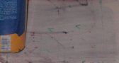

* Extreme Test Score: 4
* Typical Test Score: 5

This is in the hardware section of your favorite store.  When I purchased it from Walmart, I was not only carded, but I also apparently had a buying limit.  That minor hassle aside, this was one of the better cleaners out there.  It didn't really do much to the ink, but the rest of the marks came off with only a little work.

If you intend to use this as a cleaner indoors, make sure that you do your cleaning away from flame and turn on the fans!  The major drawback of this cleaner is that you get a nasty chemical smell.  Acetone is also the primary ingredient in nail polish remover.

Alcohol, Isopropyl - Generic
----------------------------

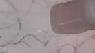

* Extreme Test Score: 4
* Typical Test Score: 5

Rubbing alcohol is cheaper and produces a bit less fumes than acetone, but its cleaning power is nearly the same.  It worked marvelously on the whiteboard marker and even removed the dull sheen that a whiteboard may accumulate.  I have heard that some brands of marker don't clean as easily with alcohol and leaving marker on the board for a very long time can make it harder to erase, but the Expo brand of markers apparently use something very similar as a solvent in their markers because it works very well for me.

Baby Oil - Johnson & Johnson
----------------------------

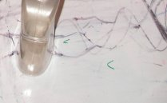

* Extreme Test Score: 1
* Typical Test Score: 1

I got this suggestion from a reader to my web site.  This was about the worst thing in the world that you can do to your whiteboard.  It removed about as much as water, but it also left an oily film that needed to be cleaned before the board could be used.

I do want to note that I did not want to actually try something like this because I saw no merit in the cleaner.  However, I wanted to be very thorough, and that's the *only* reason it is included in the test.

Cloth, Dry - Generic
--------------------

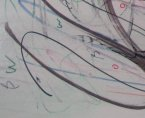

* Extreme Test Score: 1
* Typical Test Score: 3

Worked as well as expected.  Mostly wiped away the markers that were designed to be wiped away.

Cloth, Wet (Water) - Generic
----------------------------

* Extreme Test Score: 1
* Typical Test Score: 3

One should not hope that just water will remove ink, crayon, and the other things with which I coated my board.  Worked as well as we thought it would.

Sorry about the lack of a picture.  Just look at the one for vinegar instead; they both have the exact same cleaning power.

Dish Soap - Dawn
----------------

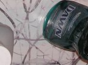

* Extreme Test Score: 1
* Typical Test Score: 3

It worked about the same as plain water.  Well, just a tiny bit better, but the difference was minimal.

Eraser Pad - Mr. Clean
----------------------

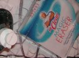

* Extreme Test Score: 1
* Typical Test Score: 3

It was advertised to remove crayon, marker, and a slew of other things.  We had to throw it away because it smeared the ink and it got into the sponge.  Don't waste your money on this product if your goal is to clean whiteboards.  It does actually remove crayon from kitchen tables, but that's a different test.

Hair Spray - Suave Naturals
---------------------------

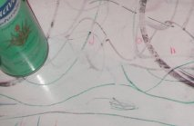

* Extreme Test Score: 3
* Typical Test Score: 2

This did pull up some of the permanent marks, but also was very ineffective on other marks.  The sticky residue brought the score down for whiteboard markers, plus you can find many better ways to remove the marks.  I would not suggest this one.

Household Cleaner - Lift Off 2
------------------------------

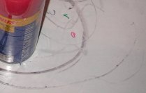

* Extreme Test Score: 2
* Typical Test Score: 3

This cleaner removed crayon and a couple of the marker streaks, but I feel that it is very ineffective.  It is no better than soapy water when it comes to whiteboard marker marks and several other cleaners outperform it when compared on how well it cleaned the other types of marks.

Household Cleaner - Lysol Kitchen Cleaner
-----------------------------------------

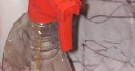

* Extreme Test Score: 2
* Typical Test Score: 3

Though it is not designed for whiteboards nor for the types of marks we were trying, this cleaner still performed adequately.  I was disappointed that the whiteboard didn't glisten when we were done cleaning it, and it left a thin film of cleaner on the surface.

Household Cleaner - Oil Eater
-----------------------------

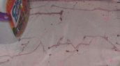

* Extreme Test Score: 4
* Typical Test Score: 4

My mother swears by this cleaner ... well, at least at the time we did the test.  She likes to try new cleaners and only the most powerful and effective ones stay.

Of course, her "champion" of cleaners did quite well.  It did not seem to really take away all of the whiteboard markers, but it made up for that with the permanent marker, ink, and other things.

Household Cleaner, Citrus - Fantastik
-------------------------------------

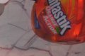

* Extreme Test Score: 3
* Typical Test Score: 4

This orange cleaner did do its best when it came to cleaning, but my test was more stubborn and the marks persisted.  You can see the streaks left by the globs of ink that was on the board.  Out of the three orange cleaners I tested, this one performed the best.

Household Cleaner, Citrus - Goo Gone
------------------------------------

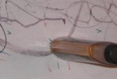

* Extreme Test Score: 2
* Typical Test Score: 4

When I added this to my list of cleaners, I initially had very high hopes for it.  I have had some amazing results with Goo Gone, but today it failed me.  It did smear the ink the least of the three orange cleaners, but that was the end of it's powers.

Household Cleaner, Citrus - Orange Glow
---------------------------------------

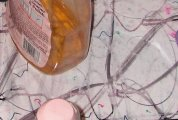

* Extreme Test Score: 2
* Typical Test Score: 4

I am not sure if rubbing an orange on the table would have been better, but it certainly would not have been worse.  As far as cleaners go, this one was pleasant to work with and very average in results.

Household Cleaner, Mixture - Vinegar & Fantastik
------------------------------------------------

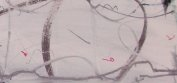

* Extreme Test Score: 2
* Typical Test Score: 3

This acted just like a slightly stronger vinegar.  The amount removed was minimal.

Household Cleaner, Mixture - Vinegar & Orange Glow
--------------------------------------------------

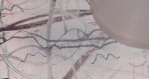

* Extreme Test Score: 2
* Typical Test Score: 3

After scrubbing on the marks, they were barely lightened.  I am not even sure that the wet-erase marks were removed properly.

Lacquer Thinner - Kleen-Strip
-----------------------------

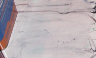

* Extreme Test Score: 3
* Typical Test Score: 2

Most of the marks were removed or lightened, but the ink was smeared around and there was this residue; a glossy substance that didn't let the whiteboard markers work again.

Marker, Dry Erase - Expo 2
--------------------------

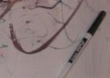

* Extreme Test Score: 2
* Typical Test Score: 3

The marker did almost nothing to the marks that were on the board, and I would suggest you try any cleaner instead of a marker.  It did pick up most of the dry erase marker that was difficult to remove, but it also is not something that I would use to clean an entire board.  If you need to get rid of small whiteboard marks from a whiteboard surface, this may be a good option for you.

Marker, Wet Erase - Vis-A-Vis
-----------------------------

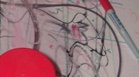

* Extreme Test Score: 1
* Typical Test Score: 1

I ruined a marker in order to show everyone that it worked just as well as a wet cloth.  You don't need to replicate this particular cleaning experiment.

Mineral Spirits - Klean-Strip
-----------------------------

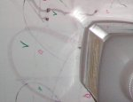

* Extreme Test Score: 3
* Typical Test Score: 4

The permanent marker was lightened, the ink was removed instead of being smeared, and a few of the marks came up.  Although this was not the best option for cleaning off the non-whiteboard tests, it did do a pretty good job with whiteboard markers.

Nail Polish Remover - Generic
-----------------------------

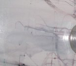

* Extreme Test Score: 4
* Typical Test Score: 5

When I say "acetone," people think it is a nasty chemical.  When I say "nail polish remover," people get a different impression and they think it is totally safe.  Well, nail polish remover is basically acetone, and the two performed similarly.  Nail polish remover is a bit easier to find, and they both removed most of the marks and slightly smeared the ink.  They also both evaporated away, leaving a clean whiteboard surface.  It did completely remove the dull sheen that whiteboard markers can leave on the surface.

Paint Stripper - Klean-Strip
----------------------------

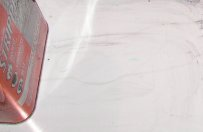

* Extreme Test Score: 1
* Typical Test Score: 1

If you are looking at the picture and you see a white board, you might ask yourself why I ranked this cleaner so poorly.  If you are ranking this product solely on the ability to remove ink, marker, and the rest of the substances, then this one is one of the best.  The ink smeared a little, but it is probable that further applications would make the rest of the ink come right off the board.

What you do not see is that this damaged the board.  If left on, even for a minute, the board surface started to bubble up and could have been wiped away with the cloth I was using.  In fact, under the frame I was unable to wipe it all away and that was bubbled up and ruined before the experiment was complete.  I'm sure that it dissolved the top layer of the board in my brief test and that makes me wonder how many times I could "clean" the board with paint stripper before the board could no longer be cleaned.  As if that is not enough, this stuff is not nice to your hands.  Avoid use if at all possible.  Be very careful if you have no other option besides paint stripper.

Stain Remover - Greased Lightning
---------------------------------

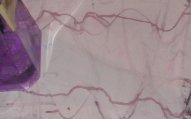

* Extreme Test Score: 4
* Typical Test Score: 5

Nearly everything was removed by this stain remover.  My mom uses it to get stains (oil, pizza, tar, etc.) off of clothing.  It looks like you can use it nicely on the board as well.  It did not have instant results like the paint stripper or MB10W, but we didn't need to work too hard to make most of the marks come off the board.

Stain Remover - Tech
--------------------

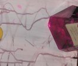

* Extreme Test Score: 3
* Typical Test Score: 4

This worked for whiteboard marker and dry erase marker, but merely lightened the rest of the stuff.  It did work better than soapy water, and it may do what you need if this cleaner is available in your house.

Tape, Clear - 3M (Scotch)
-------------------------

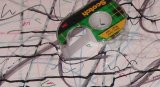

* Extreme Test Score: 1
* Typical Test Score: 2

It was suggested that clear tape could remove stubborn marks.  That may be true, but it only works for dry erase marker, and the stubborn ones may not be removed unless you keep the tape on the board for a week or more.  Plus, pulling off the tape could damage the board.

Vinegar - Heinz
---------------

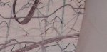

* Extreme Test Score: 1
* Typical Test Score: 3

As you can see, it only lightened the marks and really didn't remove anything except the dry and wet erase marker.  Unless you really like the smell of vinegar, use soapy water instead.

Water Displacer - WD-40
-----------------------

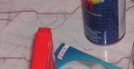

* Extreme Test Score: 2
* Typical Test Score: 2

I thought that this would be down there with the baby oil and it basically ended up there.  It did remove some more of the marks, but it didn't remove the ink nor really work well on the permanent marker.  This is made as a lubricant, though not that good of one.  It is not a cleaning product but many have found "alternate" uses for this substance.

I did get a comment that said WD-40 successfully removed a residue that built up on his whiteboard.  Spraying it on and wiping it off with a towel produced a clean board.  So, if your board has a dull sheen, maybe this will work for you too.

Whiteboard Cleaner - Expo
-------------------------

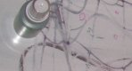

* Extreme Test Score: 2
* Typical Test Score: 4

I was hoping for more.  Here is a cleaner that is designed for whiteboards by a company that made some of the markers that I was using.  While it did actually work better than water, it did not remove the dull sheen, nor did it remove all of the stubborn whiteboard marks.  It really didn't touch the rest of the marks I had on the board.  Use it if you have it, but I threw my bottle of this stuff away after testing.

Whiteboard Cleaner - Solutions MB (MB10W)
-----------------------------------------

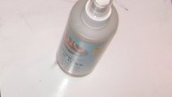

* Extreme Test Score: 5
* Typical Test Score: 5

I am unable to say enough good things about this product.  The older version caused a lot of irritation if you breathed it in, but now it is completely transformed.  If you need a serious whiteboard cleaner, you need to go check this out.

[Solutions MB](http://solutionsmb.com) contacted me and let me know about a whiteboard paint that they produce, and they told me about this cleaner.  After sending me a sample, I thought it would fail because it smelled only like soapy water.  When it came time to do the test, we sprayed the whiteboard, waited the full amount of time, and I didn't see much change in the marks.  I was still skeptical before I started wiping, but after the very first wipe, a good portion of the square was already clean.  Three or four more wipes, and I was done.

My testing partner let out a "Wow" and I wanted to test it again.  A couple spritz over on another section of the board, wait five seconds, then wiped.  Again, almost everything came off immediately.

If you are going to buy a product to clean your board, I strongly suggest this one!  After the test, we cleaned the whole 4\' x 8\' board with just a few tablespoons of the cleaner and it removed the residue left from the baby oil, Lysol Kitchen Cleaner and other substances left over from the things we were testing.

Since the testing, they have worked furiously to improve the product.  It now doesn't have any downsides!  The new version of the cleaner no longer causes any inhalation irritation and it seems to work exactly the same as the old formula.  This cleaner is able to make the whiteboards at work sparkle.  My testing whiteboards had some marks I believed were actually staining the board and would be impossible to remove.  I simply sprayed this stuff on, grabbed a paper towel and wiped gently.  Presto, those spots were gone too.  Simply remarkable and worth using.

Whiteboard Cleaner - Soytek
---------------------------

[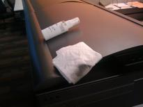](soytek-paper-towel.jpg) [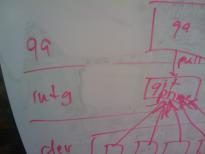](soytek-smearing.jpg)

* Extreme Test Score: Untested
* Typical Test Score: 2

This is the first manufacturer to step up and provide a sample of their cleaner for my testing.  With the fair warning that I would always publish the results, good or bad, they still followed through on their promise and delivered their product to me.

I tested this on a couple whiteboards with the same result.  Instead of picking up the marks from the whiteboard and transferring them to the paper towel I was using, they seemed to be pushed to other areas of the board.  Check out the photos for a better explanation.  The one of the "cleaned" whiteboard really shows the problem just to the left of center.  That darkish line was created by the cleaner and a minimum of the marks are being pulled up to the paper towels.

