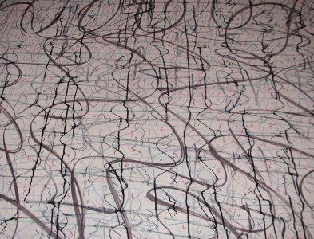

People have all sorts of different tricks that they used to clean a whiteboard.  Some things work well for whiteboard markers.  Other methods are better for marks by markers that are not dry erase.  I decided to finally put all the rumors and tips to the test.  This is just one page of my [whiteboards](../) reference.  Another great section to visit is how to [create a whiteboard](../surfaces/) using various surfaces you may have available.

I took several higher-quality photos during the test.  You can view the [whiteboard testing photo album](https://plus.google.com/photos/100011361216949115069/albums/6080979911880611553?authkey=CJHR_MTshuaXFA) for better versions of the images below.

Test Preparation
----------------

I sacrificed my large, commercial whiteboard and coated it with the following materials:

* Dry erase marker (three different brands, various colors)
* Wet erase marker (one brand)
* Permanent marker (four different brands, various colors)
* Crayon (one brand, several colors)
* Pencil (standard #2 and colored pencils)
* Ink (stamping pad refill ink)
* UV permanent marker (one brand)

To make the test really difficult for the cleaners, I let the whiteboard sit for over a month with the test marks on it. I have to admit that most cleaners wiped away the dry erase and wet erase marker without problems.  The permanent markers and UV marker didn't come off in most tests, and the stamping pad ink seeped into the board and would not come entirely off with anything.  However, if you decide to not let the ink sit as long as I did, then you will likely not have the permanent discoloration when you use the cleaners suggested below.

Testing Procedure
-----------------

The cleaner was applied, two minutes elapsed, then wipe 20 times with a clean cotton cloth.  For cleaners that did not follow the rules, we did our best.  The Mr. Clean Magic Eraser, dry cloth, and wet cloth were not left on the surface for two minutes before use.  The clear tape was left on for two minutes before being pulled off.  Markers (both dry and wet) were applied, two minutes elapsed, then a dry or wet cloth was used to wipe 20 times.

We used a limited number of wipes because we didn't want to sit and scrub with each cleaner.  One could scratch the finish off if an abrasive cleaner was used, and it would be all nice and white.  However, the next time you try to write on it, you wouldn't be able to erase it.  The goal is to find the best cleaner that makes you wipe as little as possible that is completely safe for your board surface.

Scoring
-------

We marked down scores when more scrubbing effort was required.  More points may be lost if the product left a film since we really only want to clean the board once and we don't want to clean off a residue after cleaning off the markers.

The *Extreme* score is how well the cleaner performed on all marks that were on the board and *Typical* score rates how well just the whiteboard markers were removed.  This way you can pick the best cleaner for your particular application.

Result Summary
--------------

Click a heading to sort.  Scores range from 1 to 5, with 5 being the best.  Each cleaner has a longer description below.

| Cleaner | Brand | Extreme | Typical | Notes |
|---------|-------|:-------:|:-------:|-------|
{{#data}}| {{name}} | {{brand}} | {{extreme}} | {{typical}} | {{notes}} |
{{/data}}

Untested Ideas
--------------

The readers of this site often suggest alternative ways to clean whiteboards.  Here's a collection of things that were not tested.

* Barbasol shaving cream
* Hydrogen Peroxide
* Magic Eraser - I've used this but I don't recommend it because it is slightly abrasive and that will slowly ruin the finish.
* Quick N' Brite
* SPF 30+ sunblock or sunscreen, especially aerosol spray versions
* Scrubbing Bubbles bathroom cleaner
* Tilex Mold and Mildew Cleaner
* WD40 to remove the offending marks and Awesome cleaner to remove WD40 residue
* Windex window cleaner

Individual Cleaner Write-Ups
----------------------------

I attempted to take photos of the results of each cleaner during my testing.

{{#data}}
### {{name}} - {{brand}}

{{#imageList?}}

    {{#imageList}}
        {{#full?}}
            
        {{/full?}}
        {{^full?}}
            
        {{/full?}}
    {{/imageList}}

{{/imageList?}}

* Extreme Test Score: {{extreme}} / 5
* Typical Test Score: {{typical}} / 5

{{#details}}
{{.}}

{{/details}}
{{/data}}
