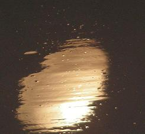
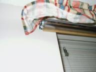
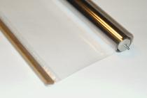

----
title:  Make a Whiteboard
template:  index.jade
js: /js/jquery-1.9.1.min.js /js/jquery.tablesorter.min.js /js/tablesorter-start.js
----

I have tried numerous types of surfaces in order to find one that is cheap and easy for people to use.  My findings may help you decide what you'd like to try.

With each surface comes advantages and disadvantages.  Some of the methods are broken down by use; you have different needs if you want one large whiteboard instead of twenty small whiteboards.  I've attempted to rate how well the surfaces perform and how expensive they are.

I rated the surfaces on eraseability with whiteboard markers only.  Ghosting, residue, and difficulty wiping away the marks all lead to a worse score.  I also try to use new surfaces because the wear on a whiteboard can cause it to become a worse surface.  I had a commercial whiteboard that has seen its share of use and it was worse than using a shower board!

The price factor reflects the approximate cost to cover a wall in the material, or essentially the cost for the surface area.  Most commercial whiteboards would get a very poor price rating even though they operate very well.

Try to keep in mind that the quality of the marker and how it works with the surface is also a key factor in judging a surface.  If it doesn't work for you, but I say it works well, try a different brand of marker and hope for the best.

If your company manufactures a whiteboard surface, you can send me a test sample for me to try.  I'll put your product up here and I'll give you a review.  However, you are not guaranteed to have a positive review if it just doesn't work.  My reviews are honest and I don't withhold negative comments.  

Summary
=======

Here's a quick run-down of uses for whiteboards and some methods that work best.

* Coating walls
    * MB4000W - This can also keep the original wall color
* Personal boards
    * Laminate sheets - Really convenient for schools
    * Plastic, page protectors
    * Polycoated cardboard
    * Contact paper
* Roll-up surface
    * Avery "Write-On Cling Sheets"
    * Plastic, sheets
* Tables and desks
    * MB4000W
    * Contact paper
* Temporary surface on wall
    * Avery "Write-On Cling Sheets"
    * Carolina Pad "Write On/Wipe Off Poster Board"
    * Tatco Whiteboard Sheets
* Whiteboard resurfacing
    * MB4000w - This is what it was designed to do

This is a table with a quick comparison of surfaces.  The higher the score, the better it works with whiteboard markers.  The higher the price, the more economical it is (ie. it costs less).  A "?" means I did not test this product yet.

| Material                                      | Score | Price | Notes                                      |
|-----------------------------------------------|:-----:|:-----:|--------------------------------------------|
| Aluminum Foil                                 |   ?   |   ?   | An interesting solution                    |
| Appliances                                    |   4   |   1   | Works in a pinch                           |
| Avery "Write-On Cling Sheets"                 |   ?   |   ?   | Reported to work                           |
| Carolina Pad "Write On/Wipe Off Poster Board" |   5   |   5   | A rollable, portable whiteboard            |
| Cellophane / Plastic Wrap                     |   1   |   5   | Good for emergencies, bad durability       |
| Ceramic Material                              |   5   |   1   | Used in high-end whiteboards               |
| Contact Paper                                 |   3   |   5   | Usually works well                         |
| Glass                                         |   5   |   2   | Works great                                |
| Laminated Sheets                              |   3   |   4   | Fairly good and inexpensive                |
| Latex Paint (High Gloss)                      |   1   |   1   | Complete failure                           |
| MB-3000 Whiteboard Coating                    |   4   |   5   | Turns a surface into a whiteboard          |
| MB4000W Whiteboard Coating                    |   3   |   5   | Water-based coating to create a whiteboard |
| Metal, Sheet                                  |   ?   |   ?   | May work for some metals                   |
| Plastic, Page Protectors                      |   2   |   5   | Good if you find the right one             |
| Plastic, Sheet                                |   4   |   5   | Very good and inexpensive                  |
| Polycoated Cardboard                          |   3   |   4   | Easy and effective                         |
| Poly Sheets                                   |   ?   |   ?   | Looks great                                |
| Polyurethane (Coating)                        |   3   |   4   | Suggestion from visitors                   |
| Tatco Whiteboard Sheets                       |   ?   |   ?   | Suggestion from a visitor                  |
| Tile board / Melamine / Shower board          |   2   |   5   | Large surface for cheap                    |
| Troy Dry Erase Sheets                         |   ?   |   ?   | Self-stick poly sheets                     |
| WallTalkers                                   |   ?   |   ?   | Dry-erase wallpaper and contact paper      |
| Whiteboard Paint                              |   ?   |   ?   | White paint (not a coating)                |

Reviews of Surfaces
===================

Some of these reviews also have instructions for how to turn this material into a useful whiteboard.

Avery "Write-On Cling Sheets"
-----------------------------

* **Score:** Untested
* **Price:** Untested

Reported to work very well.  It is just like a whiteboard that you can stick to the walls.  The 27" x 32" might be a bit small for your purposes, but it would work great for a small office whiteboard.  My only questions are about durability and long-term marker stains.  One visitor mentioned that their marker bled through the sheet and actually stained the wall.

One good thing about these sheets is that they are portable and you can just throw them when they start to get worn.

Aluminum Foil
-------------

* **Score:** Untested
* **Price:** Untested

A visitor sent in a tip to use aluminum foil, which may be a fun classroom project.  All you need is some sort of backing, aluminum foil, and some type of glue that adheres to aluminum foil.  If you want a really easy backing, you could use cardboard.  As for the glue, I would recommend spray adhesive since bonding with the foil may be a challenge and spray adhesive sticks to almost anything.

I've used aluminum foil and sometimes it works but sometimes it just utterly fails.  I have not investigated this thoroughly and believe it might have something to do with the type of foil used.

Appliances
----------

* **Score:** 4
* **Price:** 1

You can use whiteboard markers on many appliances.  The factory's coating works pretty well, but marker can get stuck in the texture sometimes.  The major drawback is that it is hard to line your wall with washers, dryers, ovens, and refrigerators.

Make sure to erase the whiteboard markers when done.  You don't want your refrigerator permanently discolored with some notes from work.

Carolina Pad "Write On/Wipe Off Poster Board"
---------------------------------------------

* **Score:** 5
* **Price:** 5

I was able to test one of these 22" x 28" pieces of plastic, and it really surprised me.  It was like having a small, rollable, handy whiteboard.  Markers erased completely and easily.  Also, the price is hard to beat; I found one retailer online that was selling this product for under $2.  The only bad thing is that it is not large enough for my table or wall, but it is great for individual work areas.

Cellophane / Plastic Wrap
-------------------------

* **Score:** 1
* **Price:** 5

The plastic with which you wrap food usually works.  This also includes most heat-shrink window insulation.  As always, test first.  This type of material works well initially, but usually stains with long-term marks.

Ceramic Material
----------------

* **Score:** 5
* **Price:** 1

This is probably outside the price range of most visitors, but really high-end whiteboards use metal and a ceramic material to make an extremely nice surface with a really high durability and lifetime when not dropped and broken.  Ceramic dishes could also work, depending on the amount of scratches on the surface.

I rated this poorly on price because most people who are visiting this web site do not usually require such an expensive solution.

Contact Paper
-------------

* **Score:** 3
* **Price:** 5
* **Pro:** Cheap and easy to find.
* **Con:** Markers left on can stain.  Contact paper eventually peels away from surfaces.

Just head to your local retailer and pick up a roll for a couple dollars.  Quick and easy.  Test it out before buying to make sure that your type of contact paper will erase cleanly because some textures and materials do not work with dry erase markers.  Typically, the cheaper contact paper works better.  You want ones that are extremely smooth and glossy.

The steps for making a whiteboard are pretty basic but there's a trick you should know to avoid bubbles under the contact paper.  First, cut the contact paper to fit and then peel back a corner.  Apply the corner to the surface, making sure it still lines up properly.  Slowly peel away more and use a flat edge, such as a credit card, to push the contact paper onto the surface.  Make sure to go slow and get rid of any air bubbles right away, since you will not be able to remove them later.

Glass
-----

* **Score:** 5
* **Price:** 2

Test first!  I have had a report that some windows do not erase well, which might indicate the window is not actual glass.

I write all over windows, glass mirrors, and glass table tops.  It would be difficult and maybe dangerous to coat a wall with glass, but at least it is a convenient surface.  Sometimes markers can be a little stubborn to erase, but numerous cleaners can get them off with almost no work.

It's extremely difficult to stain glass with markers, so this might be an option if you need to keep notes around for a while.

Latex Paint (High Gloss)
------------------------

* **Score:** 1
* **Price:** 1

A suggestion from a paint guy at the local hardware store was to use Behr High-Gloss, 100% Acrylic Latex, Ultra Pure White paint.  That didn't work at all.  The $12 quart of paint thickly coated my 4' x 8' gaming table.  However, nothing was erasable; it worked as well as paper.

Laminated Sheets
----------------

* **Score:** 3
* **Price:** 4
* **Pro:** It is quick, easy and cost-effective
* **Con:** When marks linger for a while they may stain the plastic.  It's not as easy to wipe off as a real whiteboard.

If you can get a good, smooth laminated piece of tag board or similar material, this will work for individual or small whiteboards.  Dry erase markers eventually do stain them if the marker is left on for long periods of time.  It may be difficult to erase the marker, depending on the laminate used.

If you are a teacher, this would make great individual dry erase board for your class, especially if you have access to a laminating machine at school.  Laminating tag board can give you a plain board.  You can also print out a grid, template, number line, math problems and much more.  Teachers can use these as easy, reusable worksheets for kids.  I've use this to keep track of turns and hit points during D&D battles.

The method here is simple:  Just find some tagboard and laminate it.  You may need to find a local copy shop or a school to get it laminated with one of those nice industrial-strength laminating machine.  I have heard of bad results if you try to use some types of clear contact paper or a similar sticky plastic as a laminate.  You want to find the type that is fused together by heated rollers.

MB-3000 Whiteboard Coating
--------------------------

* **Score:** 4
* **Price:** 5

I was contacted by [Solutions MB](http://www.solutionsmb.com/) regarding their whiteboard repair kit.  It is a clear coating that you can apply to a surface that will turn it into a whiteboard.  I used the product to turn my ruined whiteboard into a new "pinkboard" (I painted it pink first then applied the coating for an extremely cool effect).  The surface wipes off markers well, but not quite as well as a whiteboard.  It was $40 for 8 oz, but you use only a thin coat to turn any painted surface into a whiteboard.

The down side is that when you apply it with a foam brush, it may cause some minor streaks and really tiny bubbles to show up on the surface of the coating.  The problem I had may have been made worse because I didn't wait for the paint underneath to finish curing.  Make sure to wait a couple weeks after painting your whiteboard before applying this wonderful coating.

MB4000W Whiteboard Coating
--------------------------

* **Score:** 3
* **Price:** 5
* **Pro:** It can cover large areas and turn them into a whiteboard surface.  You can keep the original surface's colors and designs intact.
* **Con:** There is a little preparation that needs to be done in order to have this product stick properly, but the process isn't hard and is totally worth it.  Tiny lines and minuscule bubbles may form in the surface, depending on how you apply it.

[Solutions MB](http://www.solutionsmb.com/) came out with a newer version of their whiteboardcoating, MB3000.  It is water based and you don't need a well-ventilated room in order to apply it.  You need to carefully follow their instructions, but you are left with a very professional whiteboard coating on whatever surface you want.  It only takes a very thin layer of this stuff and you will be very happy with the results.  If you want to turn the walls of your house into whiteboard surfaces, this might be perfect.

This coating makes a surface that is almost the same as some high-quality boards.  Nearly anything wipes right off.  Permanent marker and crayon take just a little rubbing and they come off too.

First, you must prepare the surface.  It is best to work with the surface horizontally if possible.  They recommend you first coat your surface with a matte or eggshell, latex-based paint base.  You do not need to use white.  I used a rose colored pink.  It's possible to get the paint base before they add color to it so you can apply clear paint and preserve your original wall colors and decorations.

Wait for the paint to cure, not merely dry.  This could take a week to be safe.

Now you simply use a foam brush, roller, or other really smooth way to apply the MB4000W coating.  It doesn't take much.  You can even go over it again after an hour or two to generate a thicker coating.  Now you need to wait at least three days for the layer to cure, but then you are able to doodle on your wall, use whiteboard markers on the table, or be artistic wherever you applied the coating.

Metal, Sheet
------------

* **Score:** Untested
* **Price:** Untested

I have heard that some metals will let you use a dry erase marker on them and have it wipe off with ease.  Sometimes the metals are coated, other times they are not.  I need to delve into this area a bit more.

Do be careful with pieces of metal.  Cutting them may produce extremely sharp edges and you really wouldn't want to cut yourself.

Plastic, Page Protectors
------------------------

* **Score:** 2
* **Price:** 5

Slipping in a piece of cardboard or tag board to stiffen the plastic pocket will turn the plastic into a nice personal whiteboard.  Depending on the type of page protector, the dry erase marker may not wipe off or come off entirely.  For best results, get the really glossy and really cheap ones.  The textured ones have a harder time removing the marker.  While this isn't a good solution for my walls nor table, it may work well for you because you might already have all of the necessary materials.

Plastic, Sheet
--------------

* **Score:** 4
* **Price:** 5
* **Pro:** Inexpensive and quick to set up.
* **Con:** Marks may stain plastic.  Sometimes stays rolled and is hard to flatten.

 

I purchased a roll of plastic from a local surplus store ([Ax-Man Surplus](http://ax-man.com/)) for $2.50.  It was labeled as a roll-up heat insulator, but it looks like a clear window shade.  The plastic is pretty durable and most markers will wipe off with no effort.  If left on, my troublesome red marker left a residue, but that was removable with a cleaner.  I mounted a roll under a window shade, then pulled up the window shade to show you how well it is hidden.  You can see this picture to the right.  Nobody suspects the sheet plastic is there, yet I have an instant writable surface when needed.

Once I saw a page on the net that detailed making dry erase boards out of sheets of plastic that could be cut into the desired size, then they had supporting pieces of wood at the top and they would roll up with Velcro straps and be held as a roll until needed.  I can't find it now, but this clear shade is along the same lines as that page.  If you find that page, please let me know.

It is easy to create a board from plastic sheets.  You can cut the plastic sheet to fit your surface, or mount it on the wall.

Polycoated Cardboard
--------------------

* **Score:** 3
* **Price:** 4
* **Pro:** Typically inexpensive and usually work pretty well.
* **Con:** May be hard to find, may have advertising on the back.  Markers can stain the surface.

The backs of political yard signs or scrap from screen printing jobs may be used as a whiteboard.  The marker may be difficult or impossible to remove if it stays too long on the cardboard.

If you intend to make a whiteboard out of this material, make sure to test first.  Some of these boards do not erase at all.  After that minor inconvenience, making a whiteboard is trivial.  Cut to size.  Done.  Super easy.

Poly Sheets
-----------

* **Score:** Untested
* **Price:** Untested

It looks like [these things](http://www.kk.org/cooltools/archives/000700.php) would do the trick nicely.  If you get creative and use duct tape, spray adhesive, or another method of attaching them to your wall, you could fill the area pretty fast.

Polyurethane (Coating)
----------------------

* **Score:** 3
* **Price:** 4

The Shower Board link (below) suggests that coating something like tile board with a wipe-on polyurethane may make the tile board more like a commercial whiteboard, but it also says that their tests failed when they used a polyurethane varnish.  They say that perhaps Minwax or Varathane Professional may work.

I did try out an inconspicuous area on a Varathane coated floor.  The markers wiped right off, but I was not permitted to do an extended test.

Tatco Whiteboard Sheets
-----------------------

* **Score:** Untested
* **Price:** Untested

This is another product that I was told about but have not yet had the pleasure of testing.  They are described as portable plastic sheets that stick (static cling?) to surfaces.  It works with dry erase, wet erase, and permanent markers.  I wonder how well it stands up to use and permanent markers.  The product I see is $23 for twelve 37" x 12" sheets or $46 for twenty 37" x 24" sheets.

Tile board / Melamine / Shower board
------------------------------------

* **Score:** 2
* **Price:** 5

These are smooth, white, shower board sheets.  Usually they come in 4' x 8' panels.  Water just rolls off these things.  A single sheet coats my table nicely.  Take a marker with you and test the tile board in the store; some tile board works and others don't work at all.  I have found that the cheapest tile board works the best since it has no texture.  I have seen prices for $7 to $15 for various styles and colors.  I invested $7 to get the cheap, glossy, white kind.  After testing, it seems to work tolerably well.  The markers don't quite wipe off cleanly, but it is an extremely cheap solution when compared to a commercial 4' x 8' whiteboard.

Troy Dry Erase Sheets
---------------------

* **Score:** Untested
* **Price:** Untested

You can get a 48" x 60" roll of self-stick poly that works as a whiteboard.  Check out [Troy's website](http://www.troydryerase.com).

WallTalkers
-----------

* **Score:** Untested
* **Price:** Untested

A friend of mine mentioned he can get a type of wallpaper and a type of contact paper that would work.  It is designed as a dry erase whiteboard.  It probably would have worked wonderfully, but I don't have that kind of money available to coat the walls of my house.  Check out [WallTalkers](http://www.walltalkers.com/) and see what they have to offer.

Whiteboard Paint
----------------

* **Score:** Untested
* **Price:** Untested

I read an article on the web saying that there is whiteboard paint.  It is similar to chalkboard paint, except it is white and very glossy.  It sounded ideal, but the paint is hard to find.  There is also magnetic paint that you can use as a base coat under the whiteboard paint to make a versatile whiteboard, which also is sometimes hard to find.

I have wonderful visitors that have showed me different whiteboard paints.  One said for me to use [Markee™](http://dryerasemagic.com).  For $100 a gallon, you can turn any wall into a whiteboard.  Unfortunately, it also says the marker has to be erased within 24 hours, which is too restrictive for me.  Other visitors have steered me towards IdeaPaint, which is $3.75 a square foot (minimum 50 sq. ft. = $187.50).  Application is the same as the Solutions MB product; it is a single white-colored coating that can be painted on any smooth surface.  It does say to wipe clean after each use.

