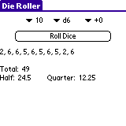

If you are a DM, then you know that there are several tables, charts, and other things that you need to look up from time to time.  Many dice get rolled when you use a breath weapon.  Experience for the party makes you look up a few things on an annoying chart and you need to divide by the number of party members.  Calculating how far you get in a day of traveling over different terrains.

If you have a Palm OS device (Palm Pilot, Handspring Visor, Sony Clié, etc.), then you are in luck.  All of these things and more are done effortlessly with this program.  It originally was based on the functionality of D&D Tools by Scott Crawford, but it has several other features that Scott has not yet implemented.

This program is free for anyone to use.  That's an unbeatable price for all of the things that are now much easier.  Since there does not seem to be any interest, this project is not moving to any online repository, but you can download the program, additional databases, and even the source code from the [download page](download/).  If you're extremely interested, there is a [developer section](developer/) that explains the database format in detail.

D&D Helper is not able to replace the books at the gaming table.  This merely speeds up gameplay.  You should still use your Player's Handbook and the other slew of books that you have on your gaming table.  Just keep your dice in your bag if you need to calculate the damage from a 10d6 fireball, roll up a magic item for treasure, or maybe find a new name for a character.

Nearly every feature of the program is listed here, by category.

Calculators
-----------

### Die Roller

Yes, nearly every D&D program has one, but mine is statistically corrected to produce random numbers that don't have the 0.1% bias that others have.  This same random number generation is used whenever a random number is needed throughout the program.  (Maybe I went a little out of my mind -- 0.1% bias is hardly worth caring about.)

### Experience Calculator

Enter average party level, number of monsters, and monster level.  You'll get the total experience for the encounter and the amount per person.

### Movement Calculator

How many miles can a monk travel over hilly ground on a clear day without a trail to follow?  Well, a 18th level monk with boots of speed can go approximately 82 mph.

### Turning Undead

Rolls all of the dice and does all of the math for you.  Just enter the charisma modifier and the character level.  It's that easy.

Reference Tables
----------------

### Ability Modifiers

What is the modifier for your giant with a Str of 23?  Find out quickly.

### Experience Points

A quick reference to see if your characters have leveled yet or not.

### Treasure Per Encounter

Keeping in mind that this is an average, it helps you to make sure your characters are as powerful as they should be.  This is per character, assuming there are four players in your party.

### Character Wealth Gain

How much each character's wealth should increase with each level.

### Party Treasure From Encounters

Very similar to the Treasure Per Encounter table, but this applies to the party as a whole.

### Average Treasure

This should let you know if you are letting too many magic items and too much money slip away to your players.  Keeping the players near their level on this chart will help balance game play.

### Character Wealth

How much gold and assets your characters should have each accumulated in the course of their travels.

Random Generators
-----------------

There are many [additional databases](download/) that can be installed on your Palm to provide additional functionality.

* Gems with gp values and descriptions
* Magic items (minor, medium, and major)
* Words that look like they belong to a particular language.
* Riddles
* Business names
* Critical hit and fumble descriptions
* Wild surges and wild surge fumbles
* Player character names from a wide variety of sources

For more information on the types of databases that D&D Helper uses, see the [developer info](developer/).  You are even able to create your own tables that are used for random generation of things.

And All The Rest
----------------

### Context-Sensitive Help

When you pick the "Help" menu option, it will display help for that particular screen -- not a generic help message.

### Easy Number Entry

When you enter a number, a separate screen pops up so you can just tap the numbers, change the sign (where applicable), and increment/decrement the number by 1.  The buttons are big enough for you to use your fingertip.

### Freeware

The program and all databases for D&D Helper that are distributed on this site are freeware.  Well, actually the program is open-source (GPL).

Credits
-------

I would like to properly thank the following people for the things that they did to help out this project:

* Sarah Akins (my wife) -- The first DM to use this program.  She also has a lot of sway on how the program looks and what goes into it.
* D&D Adventures -- Gave me permission to use the critical hit and fumble tables from [dndadventure.com](http://www.dndadventure.com) as long as I don't charge for anything.
* Scott Crawford <scott@crawford.net> -- Created D&D Tools, which I thought was a good start but didn't go far enough.  He also gave me the source to his program so that I could improve mine.  Great guy!

Links
-----

Here's links to everything that is related to D&D for the Palm.

### Palm OS Programs

* [DieRoller](http://sourceforge.net/projects/palmdieroller/) (freeware, open source) - Written in Quartus Forth, this die roller lets you roll up to 8 dice at a time and displays the roll results as well as a sum of the dice you want.

### Background / More Information

* [Chris Pound's Name Generation Page](http://www.ruf.rice.edu/~pound/) - Great site with tons of information.  His 'werd' script is actually based on psrGrammar by Mark Rosenfelder.

* [Zompist.com](http://zompist.com) - Mark Rosenfelder's language site.  He originally wrote a tool called psrGrammar, which took rules and expanded them into words.  This was later refined by Chris Pound.

Also Seen At ...
----------------

People have kindly linked to this site.  Below are the ones that I could find.  You may wish to check some of them out because they have independent review systems so you can check out the unedited reviews that others have submitted about this software.

* [D&D Adventures](http://www.dndadventure.com/dnda_dm_resources.html)
* [Palm Gaming World](http://www.palmgamingworld.com/rpg/d&dhelper.shtml)
* [RPGIndex](http://www.rpgindex.com/Software/Campaign_Managers/D20_Systems/)

Changelog
---------

### March 2015

* Due to the lack of interest, I've cleaned up the various programs.  Only the PSR formats of databases are left as they are the easiest to generate.
* Created PSR-related library, [psr-js](https://github.com/fidian/psr-js).
* Removed the PSR playground instead of porting it to JavaScript.  If you miss this, go to [psr-js](https://github.com/fidian/psr-js) and file an issue to make a testing area to demonstrate how the software works.

### 1.2 - November 2007

* Finally created a PSR database with over 127 records, causing a problem.  Fixed it when I made a magic item generation database.
* Added a couple more tables.

### 1.1 - August 2003

* Fixed capitalization errors with PSR rule generation.  Elvish Names database has been updated to capitalize the first letter.
* PHP class used to generate databases now supports capitalization of rules and chances, which now work in PSR.
* Database generation for letter pairs now produces a cache file for fast loading of data for web-based generation.
* Added web-based generation of data to show what the results would look like.
* Updated web site in many other places.

### 1.0 - July 2003

* Added help where there was none.  Reworded some other help screens just a little.
* Fixed a bug that I introduced along the way (not sure when it creeped in).  The movement calculator now works as expected.
* Since I believe that the generation routines are now working fully, and that is the landmark I wanted for version 1.0, I bumped up the number.

### 0.7 - June 2003

* Records are now appended together for the Pick One and Letter Pair sections.  This will speed up HotSyncing dramatically.
* Rewrote `dnd_helper.php` to speed up creation of databases.
* Recreated databases to use new format.  Upgrade all old copies!
* If you pop up the number input form (experience) and you press a number as the first keypress, you set the number to the keypress instead of blindly adding another digit to the number.  This is what you would expect out of a calculator.

### 0.6 - June 2003

* Added PSR generation.
* Recreated the various databases.
* Removed the 'small' databases.

### 0.5 - May 2003

* Databases can now be beamed and deleted from the Generate form.
* Various minor bugfixes.

### 0.4 - August 2002

* Fixed letter pair generator.
* Changed the screen to show a "working" message while generating the word.
* Added a binary search algorithm to make word generation for letter pairs and "pick one" much faster.
* Added the flag for databases to generate random things multiple (10) times.  Works great for word lists.

### 0.3 - July 2002

* Added random generator (letter pairs).

### 0.2 - July 2002

* Added random generator ("pick one").

### 0.1 - July 2002

* Initial version.  Included the die roller, experience calculator, movement calculator, turning tables, reference tables (ability modifiers, experience levels, treasure) and some help.
