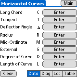
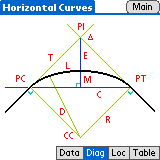
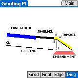
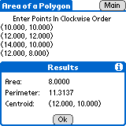

[Main Site](../)

Introduction
============

Marco acts like a specialty calculator that is geared towards surveyor's work.  The software speeds up the planning process involved with field work, and can produce quick, accurate numbers in a pinch.  It is much faster to turn on and smaller than a laptop, making it more convenient in odd situations.  When the motors are running and contractors are standing around waiting for an answer to a problem, this program can get them back to work quickly.

The software was designed to be as easy to use as possible.  When compared to some of the specialty calculators on the market, this blows them away.  The friendly prompts have descriptive explanations, and built-in help is available for every screen.

While designed for the field, people "in the office" use Marco for getting quick solutions to problems, where they used to use a calculator.  Students studying surveying can also benefit from the program, and use it for class or possibly intern work.  It is also possible that professional landscapers, architectural designers, and construction workers could use Marco for various applications in their fields.

For almost every screen, Marco uses formulas that do not require a unit of measure to be used.  You must enter all information in the same unit for all lengths, coordinates and values..  Therefore, if all information is entered in as feet, the answer will also be in feet.

Getting Started
===============

First [download](../) the zip file, which includes MathLib and documentation.  Extract this and double-click on `marco.prc` to schedule it to be HotSync'd to the Palm.  Do the same for MathLib.  Next, just HotSync the Palm and it shall be installed.

Marco also supports beaming the application.  To beam Marco, tap on the Applications button, and then on the Menu button.  Select Beam under the App menu.  Now select Marco and tap the Beam button.  Make sure both Palms are within range, and the other person has "Beam Receive" (in the preferences) turned on.

MathLib can also be beamed to another Palm with the same method, or it
can be beamed from within Marco by looking in the menu for the option "Beam MathLib".

To start the software, tap on the Applications button to bring up the list of programs on your Palm.  Look for the "M" icon of Marco and tap it.

Screen Layout
=============

Marco tries to use a similar, familiar interface on all of the screens it has.  It will start out on the Main Menu, where you can press a button to do a specific function.  From all pages except the Main Menu, there is a "Main" button in the upper right-hand corner that will jump you back to the starting screen.

To enter information, tap on a button.  So, if a program requires an X coordinate, it will have a button labeled with "Enter X" showing that a value is needed there.  When pressed, it will bring up an appropriate input screen where an angle, value, or other information can be entered.  For more information about the prompting that Marco performs, see Entering Information in this manual.

Information, once entered, can not be overwritten by tapping the button again.  This is because once information has been entered or calculated, it can change many other values internally.  Pressing the Clear button in the lower left corner will erase what you were working on and will allow you to start over.  In some instances, single values can be cleared.  There will be an X button immediately to the left of the value that can be cleared.  Tapping the X will erase just that one number and will keep the rest.

Sometimes, buttons will be hidden from view so that information is not entered in the wrong spot at the wrong time.  Don't worry; they will come back at the appropriate times and be filled in with calculated data automatically.

If there are multiple screens that a particular program uses, there will be a bar in the lower right corner with abbreviations of all the screens.  Tapping on one of them will go to that page.

Marco can use multiple point files.  A single point file is a collection of points, typically for a single project.  It helps keep points with the same name, but different projects, separate.  The current point file is displayed in the upper-right hand corner of the Main Menu.  To switch to another point file, tap on the name of the current point file.  A list of all available point databases on the Palm will be displayed.  Select one from the list, or pick the Manage Databases option to handle creating, deleting, renaming, and beaming of point files.

Entering Information
====================

When you need to enter information into Marco, there will be an appropriate form that will pop up and ask for a value.  The forms change with what type of data is being entered.  Also, there is an optional keypad on the screen (set up in the preferences section) that can assist when entering numbers.  Additionally, the style that angles are entered in (degrees, radians, DMS, gradians) is set in the preferences.

   

When the form is up, tapping on the buttons on the keypad will enter numbers, and the standard Palm graffiti method of inputting data works as well.

Context-Specific Help
=====================

By tapping on the menu button, and then picking Help under the Marco menu,
it will show information about the current screen or form.  That way, if you
get stuck or you don't know what a particular value is, an explanation is
always easily available and is built-in to every copy of Marco.

Individual Screens
==================

Each of the screens are detailed below.

Horizontal Curves
-----------------

   

Horizontal curves are used when making a left or a right turn on a road, and could also be applied to borders in landscaping, making a curved sidewalk, or dozens of other applications.  The program is divided into four screens.  The "Data" screen is where the information describing the curve is entered.  "Diag" is a diagram illustrating the lengths and locations of points that are involved in the curve.  "Loc" contains information about the location of the curve.  "Table" will show a series of points along the curve with their cord length and angle of 
deflection.

Vertical Curves
---------------

   

Vertical curves are necessary when changing inclines due to going over a hill, down into a valley, or from a flat area to a different elevation.  Like Horizontal Curves, this has four screens as well.  The "Data" screen shows the variables that need to be defined in order to create a curve.  "Diag" shows an illustration of two vertical curves, which labels the points and lengths that are needed.  "Query" finds specific elevations or stations on or outside the curve.  "Table" lists the elevations of a series of points that are on the curve.

Center Line for Curves
----------------------

   

Center Line for Curves will locate a series of X and Y coordinates that are along a line or offset from a line.  This allows the creation of lanes on a road, sidewalks, and ditch lines.  Because the curve and the location of the curve must be defined, there are several variables required.  They are unable to be squeezed on just one screen, and have been broken up onto four different forms.

If everything is known about a curve and the first data screen can be filled in completely, the rest of the curve will be properly defined automatically.  If not, enter known values on the first three data screens and the unknown ones will be calculated when enough information is entered.

The fourth data page is special and sets up the information required for the "Table" screen.  If you plan on only using the "Query" screen, it does not need to be filled in.

  

The "Diag" tab shows diagram of a sample center line and where all of the lengths, points, and angles are located.  "Query" allows the user to find the location of an offset at a specific station, and calculates the station and offset of an entered coordinate pair.  "Table" lists a series of points that are a given offset away from the center line.  By tapping on the "L" and "R" buttons, the offset will be to the left or right of the curve.  By tapping on a point, the selected point's coordinates can be saved to the current point file.

Intersection
------------

  

Intersection acts like three programs in one.  It can find the intersection of two lines, two circles, or a line and a circle.  Start by selecting what the first object is by tapping the Line or Circle buttons.  In the image above, the first object is a line.  Then, define the location of that object.  When done, tap on the Object 2 button and select if it is a Line or a Circle.  In the example above, the second object is a circle.  After defining the location of the object, tap on Result to see where the two entities intersect and the distances from any
coordinates that were entered.

Proportion
----------

 

This program calculates a proportional increase or decrease.  It is used when expanding a road to accommodate another lane, a turn lane, or to shrink a road right before a bridge.  The "Data" form defines the starting and ending values along with the starting and ending stationing.  It also sets the increment for the Table screen.  "Table" shows a list of stations and the proportional value at each location.

Inverse
-------

Inverse can take two points and calculate the azimuth and distance between them.  It can also determine a second point's coordinates when given a starting point, an azimuth, and a distance.  Pressing the "Traverse" button will put the second point's coordinates in as the starting point, so another point can be calculated.

Center Line for Lines
---------------------

   

To find a series of points that are a given offset from a line, or to find information about how far a particular point is away from a line, use Center Line for Lines.  MnDOT uses this for marking lanes, shoulders, and sidewalks that are a given distance away from the center of the road.  Enter information on the two "Data" screens.  The "Starting Point" form asks for where the line starts and further information needed for the "Table" page.  "Direction" records where the line travels to.  Once the line is defined, use the "Query" screen to find the station and offset of any point, or find the coordinates for a given station and offset.  "Table" will generate a list of coordinates at specific stations.  The "L" and "R" buttons change the offset to be left and right, accordingly.

Grading PI
----------

   

Finding the elevations and widths of the lanes, shoulder, and embankment of a road involves many calculations.  This section of Marco makes that process easier.  The "Grad" screen contains all of the information about the grading for the road.  "Final" is the finished road for the shoulder and lanes.  The embankment's measurements are covered with the "Edge" form.  To help locate reference points, a cut-away side view of a road is on the "Diag" page.

Area of a Polygon
-----------------

 

Squares, triangles, and anything else with a border made of straight line segments can have their areas calculated.  Press "Add" to add a point, or "Pick" to select a saved point from a point list.  When done defining the border, the "Calc" button will display the area of the object, the perimeter around the outside, and the centroid.  "Del" will erase the selected point from this screen and "Clear" will start the process over.

Triangles
---------

 

Triangles can be calculated by entering any side and two other values (sides or angles).  This unique tool has two different ways of displaying the same information.  By going into Preferences, it is possible to change between the tabular view (on the left) and the spatial view (on the right).

Angle Converter
---------------

This simple utility converts angles from one type to another.  To enter an angle, just tap on the buttons in the middle.  The "+" and "-" buttons allow you to add and subtract an angle from the one currently displayed.  Angles are always positive, and are from 0 to just under 360°.

Quadratic Formula Solver
------------------------

A quick calculator that will find the X intercepts for a given quadratic equation.

Edit Points
-----------

  

This interface allows easy manipulation of saved points.  It will list all of the points in the currently open file.  By selecting one and pressing "View," the X and Y coordinates, the elevation, and the station, will be displayed.  Points may not have all of those values, so it leaves blank anything that wasn't entered.  If the "Edit" button is pressed, those values can be altered.  "Delete" removes a point from the list permanently.  It is not possible to undelete a point, so be careful.

On the Edit screen, the Description field does not have an "X" button to clear it.  To rename a point, just tap on the Description button and it will allow a new name to be entered.

Preferences
-----------

   

Many attributes about how Marco operates are configurable.  The Preferences section is where configuration options are accessed.  "Units of Measure" configures how angles are entered and displayed, and how coordinates are used.  With "X, Y" coordinates, the X is always prompted for first.  Likewise, "Northing, Easting" will always ask for the Northing before the Easting.

"Numbers and Precision" defines how many digits beyond the decimal point should be shown in varying circumstances.  The amount of precision for each type of angle measurement is configured separately, and the various numbers also have the same options.  In order to save space, any trailing zeros can be removed from numbers in tables, in the buttons, and in other assorted places by checking the appropriate box.

On the "Entering Information" page, you can turn off confirmation of deletions in the Edit Points screens, and will turn on and off the number pad that is used when entering information.  The "Tabular" and "Spatial" buttons toggle between the different layouts for the Triangles form.

When changing the settings, make sure to hit "Save" when done, or "Cancel" to go back without saving the new settings.

Manage Databases
----------------

 

Marco can use multiple point databases to keep individual points separated into groups.  To switch to another database, go to the main page and tap on the name of the currently open point file in the upper right hand corner.  (Marco creates the default point file called "Marco Points" initially.)  This will bring up a list of available point files on your Palm.  Select another one to use that alternate point file.

If "Manage Databases" is picked, Marco will display a special screen where point files can be created, deleted, and renamed.  If a point file is deleted, it can not be restored, so be careful.

Frequently Asked Questions (FAQ)
================================

This is a list of common questions asked about Marco itself or about topics that relate to Marco.

Points
------

### I edited a point and it no longer appears in the list of points.  What happened to it?

Marco sorts point names alphabetically because that is the only method that Palm OS supplies.  Unfortunately, this means that a list of 1, 2, 10, and 11 would be sorted as 1, 10, 11, 2.  A screen capture, to the right, shows this odd behavior.  It sorts the first letter, then the second letter, then the third.  It doesn't sort the number as an actual number.

If this method of sorting is hard to get used to, just add zeros at the beginning so that all of the numbers are of the same length.  The above set of numbers with zeros at the beginning would sort to 01, 02, 10, 11.

Calculators
-----------

### How accurate is Marco?

Marco uses MathLib for number calculations, which provides IEEE-754 double-precision math functions.  It's roughly 13 digits of accuracy.

### Why can't I go to the calculator and back to Marco without losing everything I entered?

If you leave Marco and come back, all of the data entered will be cleared away.  I do this to save memory, make upgrades easier, and to avoid several programming hassles.  I agree that it is annoying when you need to look up information in your calculator, and I strongly suggest using a popup calculator to solve the problem.  Popup calculators can appear "on top" of any running program on a Palm, and will let you calculate numbers quickly.

### Is there an alternate calculator that I can use instead of the built-in one?

Yes.  There are several, one of which is sure to fit your needs.  See the earlier section on Calculators.

### Why doesn't Marco have a built-in calculator?

Having a calculator added to Marco was seriously debated many times.  It was decided to not be added to the program for several reasons:

* It would make Marco bigger (it is quite large enough).
* If it is an RPN calculator, infix people would be annoyed.  If it was an infix calculator, RPN people would be annoyed.  If it was both, the program would be much bigger.
* More potential for bugs in the system.
* It wouldn't integrate easily with the calculator button.
* There are several great calculators out there already.

Miscellaneous
-------------

### Which handheld should I buy to use Marco?

The only requirement for a handheld is that it runs Palm OS 3.0 or newer.  It might run with Palm OS 2.0, but that hasn't been tested.  Marco has been tested to run on several versions of Palm Pilots, Handspring units, and even a Palm OS based cell phone.  If you are buying a new device, make sure it runs "Palm OS" -- it will not run on Palm-sized computers running Windows CE or other operating systems.

If you are going to buy a device and want to know which one I recommend, here are my suggestions:

* Brand:  One is as good as another.  I'd suggest Handspring, but they just merged back with Palm, so there isn't really any difference there.
* Memory:  2 megs of memory is enough for hundreds of thousands of points for Marco, a few custom applications, tons of addresses, several memos, and a large todo list.  If you plan on using the Palm a lot, or if you want to have space to spare, I would suggest 8 or 16 megs.
* Color/Black & White:  Color screens are *very* pretty, and they show up nice in dark areas.  Black & white screens draw much less power, so the handheld can run longer without recharging or replacing the batteries.  If this is for work, get black and white.  If it is for play, home use, or for testing out programs, color is nice.
* Hi-res/Standard Resolution:  The newer high-res screens are nice and make reading less fatiguing.  I would suggest a high-res screen if possible.  It works well with many games, document readers, and other sorts of programs.  Overall, it will smooth out fonts to make them more appealing and rounds buttons a bit nicer.
* Price:  If it is going to be used out in the field, don't get a very expensive one.  Dust can quickly scratch up the screen, accidents happen, and Palms can get dropped.  Of course, get whatever you think is needed and would be used.
* Accessories:  A case.  Get a good case.  A nice, sturdy padded case with Velcro and a zipper around the Palm is a good idea.  A metal case that is able to withstand abuse is a good idea.  I can not suggest this enough -- get a good case for the Palm.  It *will* get dropped.
