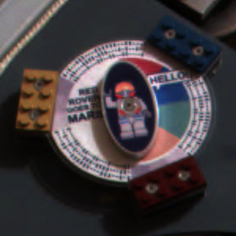

There's a code along the outside rim of the DVD attached to the Mars rover named Spirit. It was a challenge posed with clues given in January 2004.

Examples:

*  - This was the first hint for how to solve the shorter code that's displayed on the DVD.

*  - The code from the DVD. It is easiest if you look only at the upper left and work from left to right, from outside to inside. The other two portions of code are the same message.

